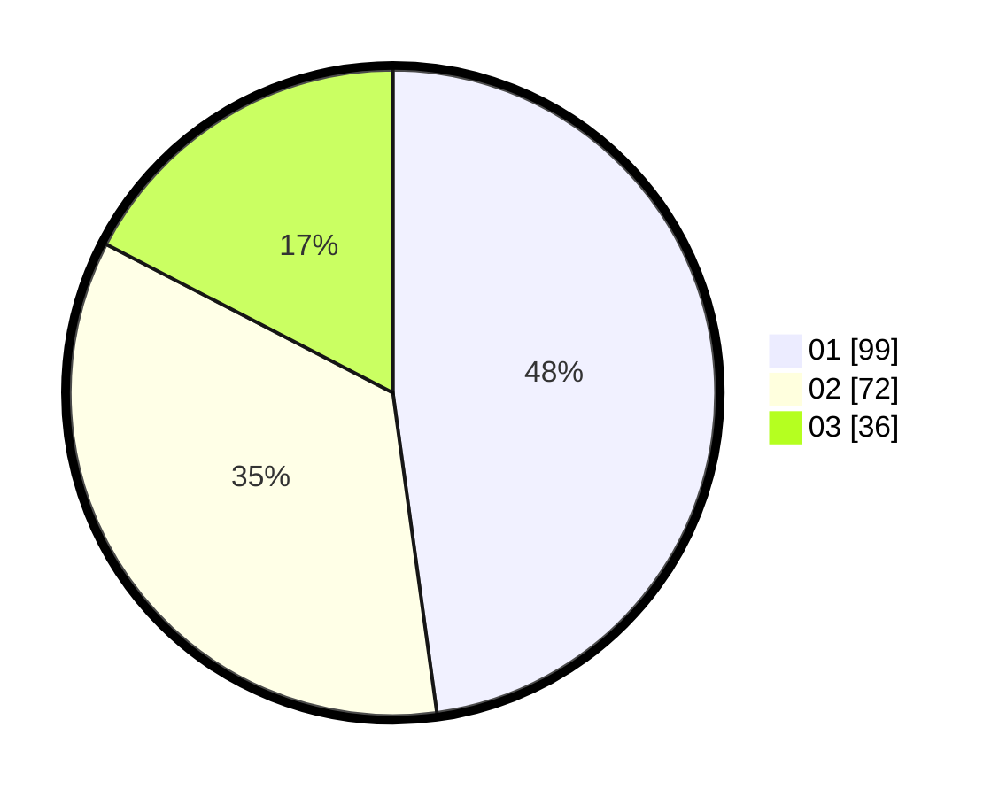

# Hasil

Hasil perolehan suara paslon dapat dilihat pada file paslon-01.txt, paslon-02.txt, dan paslon-03.txt.

Jika tidak ada, artinya data tersebut belum ada pada SIREKAP.

## Perolehan Suara

 * Paslon 01: **99**.
 * Paslon 02: **72**.
 * Paslon 03: **36**.

## Foto C Plano

https://sirekap-obj-formc.kpu.go.id/2ef7/pemilu/ppwp/31/72/04/10/06/3172041006008-20240214-195155--a432193d-902c-4b42-841c-23029818daf7.jpg

https://sirekap-obj-formc.kpu.go.id/2ef7/pemilu/ppwp/31/72/04/10/06/3172041006008-20240214-195208--25d9344a-b12d-4488-977d-e61e1310e797.jpg

https://sirekap-obj-formc.kpu.go.id/2ef7/pemilu/ppwp/31/72/04/10/06/3172041006008-20240214-195223--87ef9eb9-0c28-418e-a086-fc62ab4bbf59.jpg

## DATA PEMILIH TETAP

Jumlah pemilih dalam DPT: **268**.
 * L: **127**.
 * P: **141**.

## DATA PENGGUNA HAK PILIH

Jumlah pengguna hak pilih dalam DPT: **209**.
 * L: **98**.
 * P: **111**.

Jumlah pengguna hak pilih dalam DPTb: **2**.
 * L: **2**.
 * P: **0**.

Jumlah pengguna hak pilih dalam DPK: **0**.
 * L: **0**.
 * P: **0**.

Jumlah pengguna hak pilih: **211**.
 * L: **100**.
 * P: **111**.

## JUMLAH SUARA SAH DAN TIDAK SAH

JUMLAH SELURUH SUARA SAH: **207**.

JUMLAH SUARA TIDAK SAH: **4**.

JUMLAH SELURUH SUARA SAH DAN SUARA TIDAK SAH: **211**.
