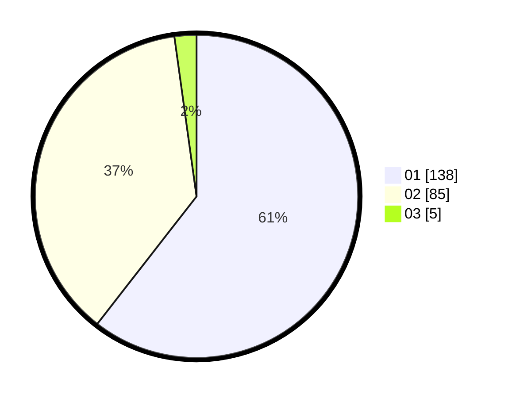

# Hasil

Hasil perolehan suara paslon dapat dilihat pada file paslon-01.txt, paslon-02.txt, dan paslon-03.txt.

Jika tidak ada, artinya data tersebut belum ada pada SIREKAP.

## Perolehan Suara

 * Paslon 01: **138**.
 * Paslon 02: **85**.
 * Paslon 03: **5**.

## Foto C Plano

https://sirekap-obj-formc.kpu.go.id/8f5f/pemilu/ppwp/31/72/04/10/06/3172041006013-20240214-214054--40f96183-21c4-4bbb-b758-6e621d8736ea.jpg

https://sirekap-obj-formc.kpu.go.id/8f5f/pemilu/ppwp/31/72/04/10/06/3172041006013-20240214-155445--bf6f9c2c-42bb-44d1-b73f-0ee9373a886f.jpg

https://sirekap-obj-formc.kpu.go.id/8f5f/pemilu/ppwp/31/72/04/10/06/3172041006013-20240214-214405--9058c964-5438-4dc4-9076-e7902fb52959.jpg
