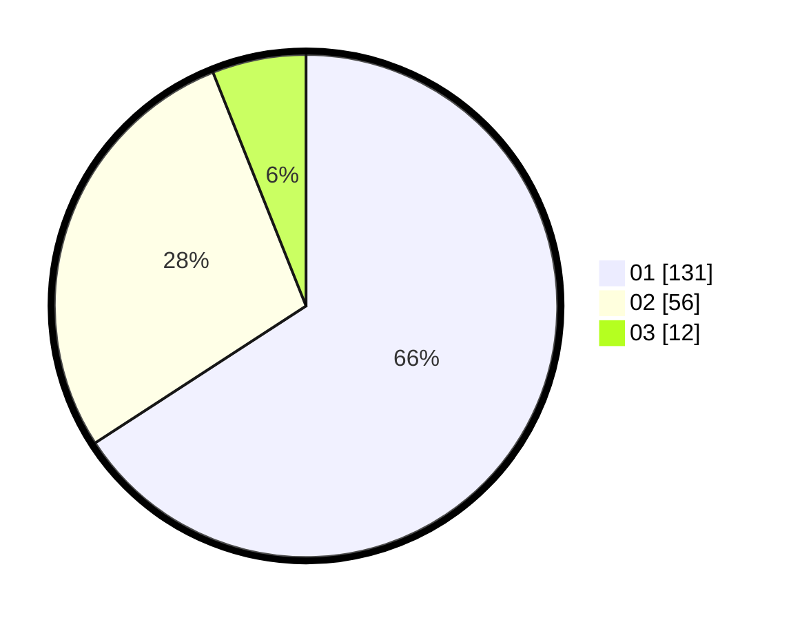

# Hasil

Hasil perolehan suara paslon dapat dilihat pada file paslon-01.txt, paslon-02.txt, dan paslon-03.txt.

Jika tidak ada, artinya data tersebut belum ada pada SIREKAP.

## Perolehan Suara

 * Paslon 01: **131**.
 * Paslon 02: **56**.
 * Paslon 03: **12**.

## Foto C Plano

https://sirekap-obj-formc.kpu.go.id/f57d/pemilu/ppwp/31/72/04/10/06/3172041006014-20240216-005252--cd7a40b9-205d-42c9-84f4-67a85b231467.jpg

https://sirekap-obj-formc.kpu.go.id/f57d/pemilu/ppwp/31/72/04/10/06/3172041006014-20240214-155315--3f22bc36-cc79-4fef-baeb-a683c10e8ba7.jpg

https://sirekap-obj-formc.kpu.go.id/f57d/pemilu/ppwp/31/72/04/10/06/3172041006014-20240214-155504--cc4a1fc5-5adb-4cd6-baa2-d0d491b0a944.jpg

## DATA PEMILIH TETAP

Jumlah pemilih dalam DPT: **265**.
 * L: **135**.
 * P: **130**.

## DATA PENGGUNA HAK PILIH

Jumlah pengguna hak pilih dalam DPT: **202**.
 * L: **95**.
 * P: **104**.

Jumlah pengguna hak pilih dalam DPTb: **1**.
 * L: **0**.
 * P: **1**.

Jumlah pengguna hak pilih dalam DPK: **2**.
 * L: **0**.
 * P: **2**.

Jumlah pengguna hak pilih: **205**.
 * L: **98**.
 * P: **107**.

## JUMLAH SUARA SAH DAN TIDAK SAH

JUMLAH SELURUH SUARA SAH: **199**.

JUMLAH SUARA TIDAK SAH: **6**.

JUMLAH SELURUH SUARA SAH DAN SUARA TIDAK SAH: **205**.
