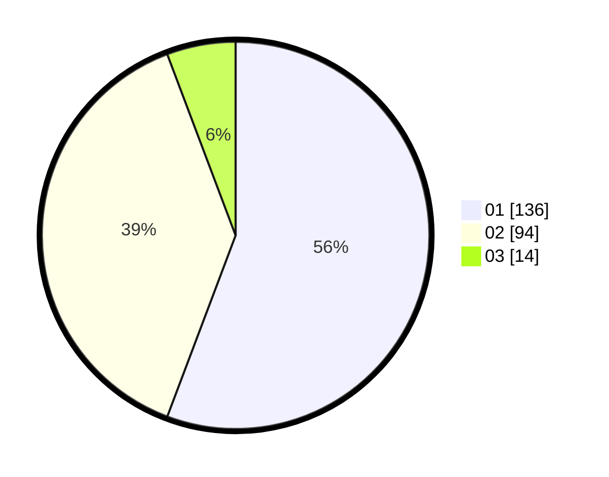

# Hasil

Hasil perolehan suara paslon dapat dilihat pada file paslon-01.txt, paslon-02.txt, dan paslon-03.txt.

Jika tidak ada, artinya data tersebut belum ada pada SIREKAP.

## Perolehan Suara

 * Paslon 01: **136**.
 * Paslon 02: **94**.
 * Paslon 03: **14**.

## Foto C Plano

https://sirekap-obj-formc.kpu.go.id/eb74/pemilu/ppwp/31/72/04/10/06/3172041006017-20240215-220221--8ef523d9-ac27-4b3f-9418-1f302808ea1b.jpg

https://sirekap-obj-formc.kpu.go.id/eb74/pemilu/ppwp/31/72/04/10/06/3172041006017-20240215-220054--5ac01cdf-914b-433f-ac7c-83abe7690971.jpg

https://sirekap-obj-formc.kpu.go.id/eb74/pemilu/ppwp/31/72/04/10/06/3172041006017-20240216-003047--e6d81e24-60b3-4bc9-b95d-9d7eb366d55e.jpg

## DATA PEMILIH TETAP

Jumlah pemilih dalam DPT: **284**.
 * L: **140**.
 * P: **144**.

## DATA PENGGUNA HAK PILIH

Jumlah pengguna hak pilih dalam DPT: **241**.
 * L: **113**.
 * P: **128**.

Jumlah pengguna hak pilih dalam DPTb: **1**.
 * L: **1**.
 * P: **0**.

Jumlah pengguna hak pilih dalam DPK: **4**.
 * L: **2**.
 * P: **2**.

Jumlah pengguna hak pilih: **246**.
 * L: **116**.
 * P: **130**.

## JUMLAH SUARA SAH DAN TIDAK SAH

JUMLAH SELURUH SUARA SAH: **244**.

JUMLAH SUARA TIDAK SAH: **2**.

JUMLAH SELURUH SUARA SAH DAN SUARA TIDAK SAH: **246**.
