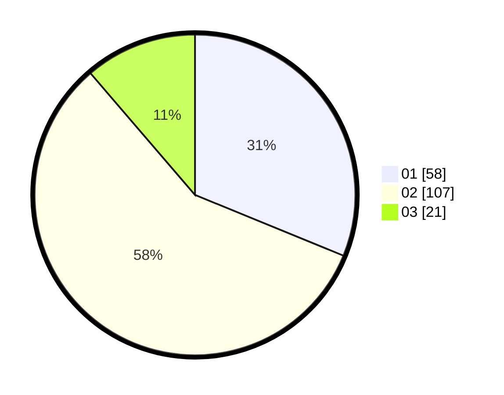

# Hasil

Hasil perolehan suara paslon dapat dilihat pada file paslon-01.txt, paslon-02.txt, dan paslon-03.txt.

Jika tidak ada, artinya data tersebut belum ada pada SIREKAP.

## Perolehan Suara

 * Paslon 01: **58**.
 * Paslon 02: **107**.
 * Paslon 03: **21**.

## Foto C Plano

https://sirekap-obj-formc.kpu.go.id/aab0/pemilu/ppwp/31/72/04/10/06/3172041006027-20240214-230119--56189402-c6f2-4417-bd96-63caf8a3bfe2.jpg

https://sirekap-obj-formc.kpu.go.id/aab0/pemilu/ppwp/31/72/04/10/06/3172041006027-20240214-230345--0c7d511f-1421-45ac-9ac8-6383c65c58a1.jpg

https://sirekap-obj-formc.kpu.go.id/aab0/pemilu/ppwp/31/72/04/10/06/3172041006027-20240214-230600--c9d038af-7b3a-49a3-90d8-9fae2f8eb364.jpg

## DATA PEMILIH TETAP

Jumlah pemilih dalam DPT: **244**.
 * L: **126**.
 * P: **118**.

## DATA PENGGUNA HAK PILIH

Jumlah pengguna hak pilih dalam DPT: **202**.
 * L: **107**.
 * P: **95**.

Jumlah pengguna hak pilih dalam DPTb: **6**.
 * L: **4**.
 * P: **2**.

Jumlah pengguna hak pilih dalam DPK: **4**.
 * L: **2**.
 * P: **2**.

Jumlah pengguna hak pilih: **212**.
 * L: **113**.
 * P: **99**.

## JUMLAH SUARA SAH DAN TIDAK SAH

JUMLAH SELURUH SUARA SAH: **196**.

JUMLAH SUARA TIDAK SAH: **16**.

JUMLAH SELURUH SUARA SAH DAN SUARA TIDAK SAH: **212**.
