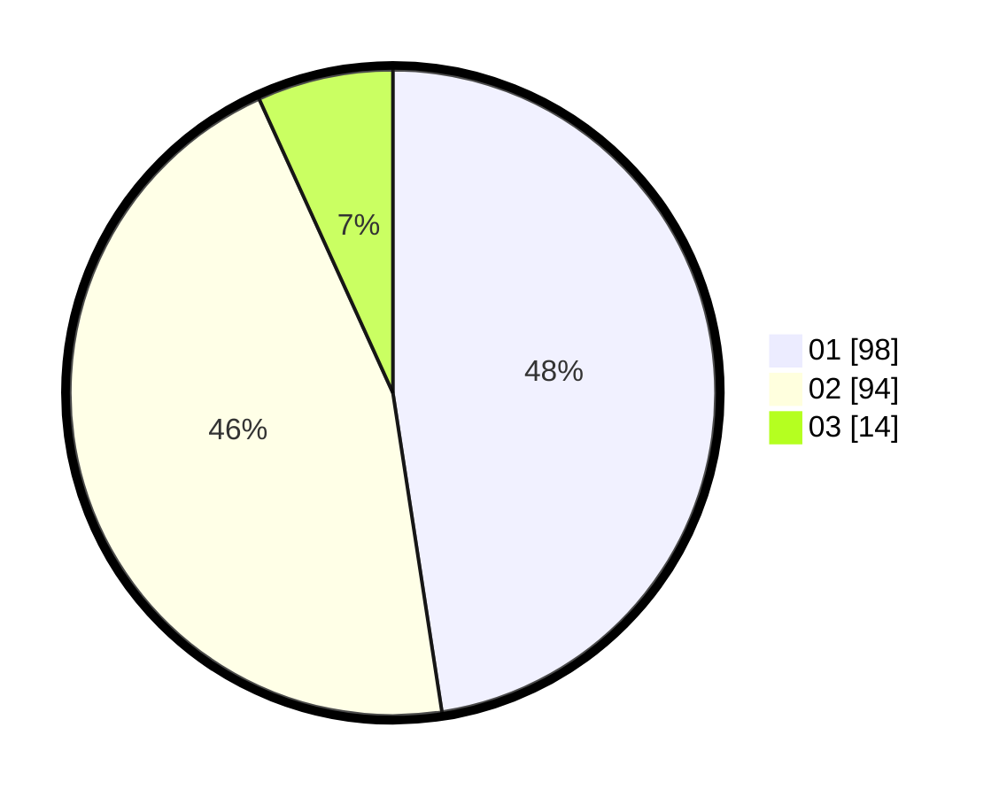

# Hasil

Hasil perolehan suara paslon dapat dilihat pada file paslon-01.txt, paslon-02.txt, dan paslon-03.txt.

Jika tidak ada, artinya data tersebut belum ada pada SIREKAP.

## Perolehan Suara

 * Paslon 01: **98**.
 * Paslon 02: **94**.
 * Paslon 03: **14**.

## Foto C Plano

https://sirekap-obj-formc.kpu.go.id/4d0d/pemilu/ppwp/31/72/04/10/06/3172041006034-20240214-155218--0e1daafd-67e1-4c76-9958-fad192782c44.jpg

https://sirekap-obj-formc.kpu.go.id/4d0d/pemilu/ppwp/31/72/04/10/06/3172041006034-20240214-155325--b455dfc7-aa85-42b2-bcb6-4b8be4fc6a5c.jpg
