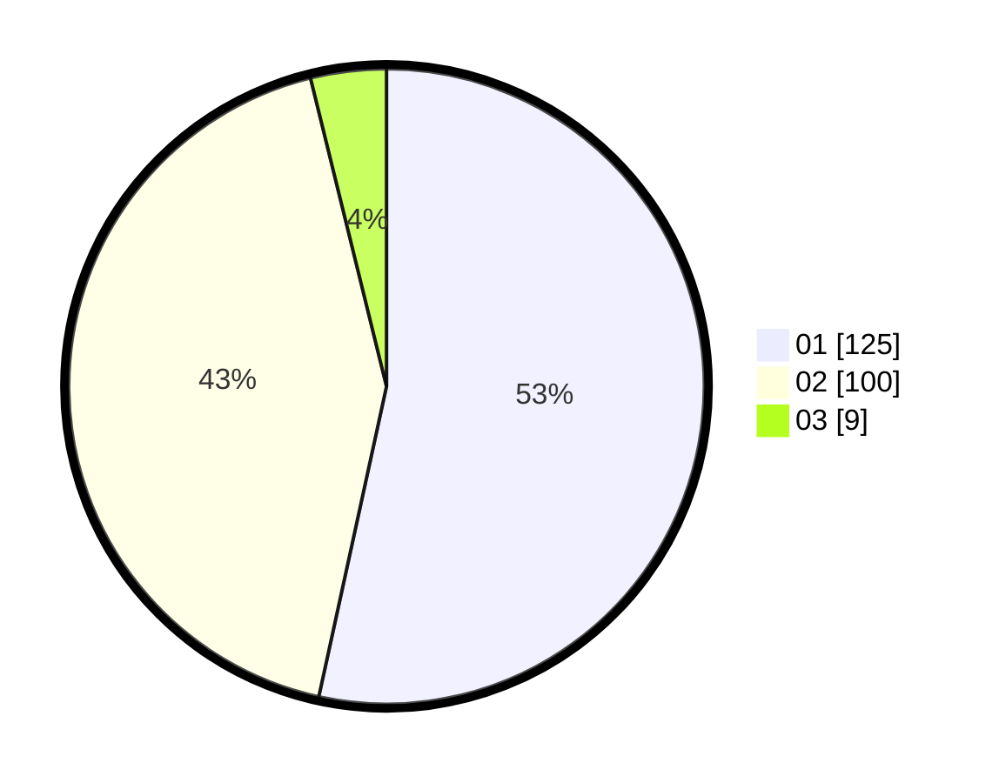

# Hasil

Hasil perolehan suara paslon dapat dilihat pada file paslon-01.txt, paslon-02.txt, dan paslon-03.txt.

Jika tidak ada, artinya data tersebut belum ada pada SIREKAP.

## Perolehan Suara

 * Paslon 01: **125**.
 * Paslon 02: **100**.
 * Paslon 03: **9**.

## Foto C Plano

https://sirekap-obj-formc.kpu.go.id/3dac/pemilu/ppwp/31/72/04/10/06/3172041006049-20240215-025424--802feb36-56bf-4635-a4ea-bebed6cda8fb.jpg

https://sirekap-obj-formc.kpu.go.id/3dac/pemilu/ppwp/31/72/04/10/06/3172041006049-20240215-025521--b3438ccb-fb1d-44d6-bafd-53decb9e76f1.jpg

https://sirekap-obj-formc.kpu.go.id/3dac/pemilu/ppwp/31/72/04/10/06/3172041006049-20240215-025618--74fdea12-9a88-4e8b-a570-43877a3539f7.jpg

## DATA PEMILIH TETAP

Jumlah pemilih dalam DPT: **285**.
 * L: **143**.
 * P: **142**.

## DATA PENGGUNA HAK PILIH

Jumlah pengguna hak pilih dalam DPT: **229**.
 * L: **112**.
 * P: **117**.

Jumlah pengguna hak pilih dalam DPTb: **1**.
 * L: **1**.
 * P: **0**.

Jumlah pengguna hak pilih dalam DPK: **8**.
 * L: **5**.
 * P: **3**.

Jumlah pengguna hak pilih: **238**.
 * L: **118**.
 * P: **120**.

## JUMLAH SUARA SAH DAN TIDAK SAH

JUMLAH SELURUH SUARA SAH: **234**.

JUMLAH SUARA TIDAK SAH: **4**.

JUMLAH SELURUH SUARA SAH DAN SUARA TIDAK SAH: **238**.
