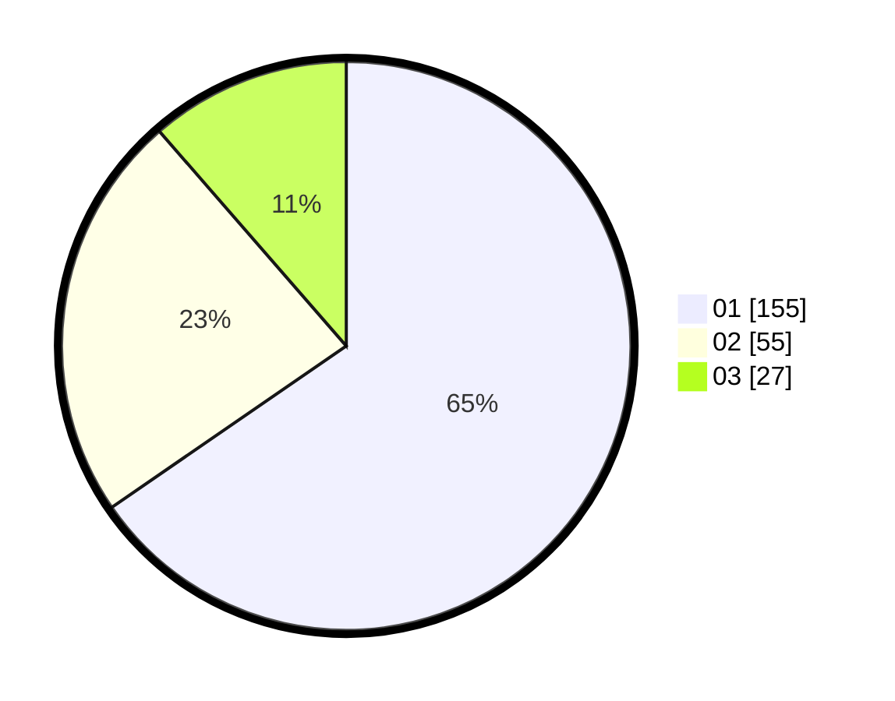

# Hasil

Hasil perolehan suara paslon dapat dilihat pada file paslon-01.txt, paslon-02.txt, dan paslon-03.txt.

Jika tidak ada, artinya data tersebut belum ada pada SIREKAP.

## Perolehan Suara

 * Paslon 01: **155**.
 * Paslon 02: **55**.
 * Paslon 03: **27**.

## Foto C Plano

https://sirekap-obj-formc.kpu.go.id/43d3/pemilu/ppwp/31/72/04/10/06/3172041006052-20240215-001801--54ae0b91-5c44-40a5-bdcf-f1290807ea13.jpg

https://sirekap-obj-formc.kpu.go.id/43d3/pemilu/ppwp/31/72/04/10/06/3172041006052-20240215-001918--86e06019-9139-41c3-80f0-6dd0f391559d.jpg

https://sirekap-obj-formc.kpu.go.id/43d3/pemilu/ppwp/31/72/04/10/06/3172041006052-20240215-002200--96bf8841-1b5c-4dc1-9a9c-83d010f67516.jpg

## DATA PEMILIH TETAP

Jumlah pemilih dalam DPT: **290**.
 * L: **145**.
 * P: **145**.

## DATA PENGGUNA HAK PILIH

Jumlah pengguna hak pilih dalam DPT: **241**.
 * L: **122**.
 * P: **119**.

Jumlah pengguna hak pilih dalam DPTb: **1**.
 * L: **1**.
 * P: **0**.

Jumlah pengguna hak pilih dalam DPK: **7**.
 * L: **3**.
 * P: **4**.

Jumlah pengguna hak pilih: **249**.
 * L: **126**.
 * P: **123**.

## JUMLAH SUARA SAH DAN TIDAK SAH

JUMLAH SELURUH SUARA SAH: **248**.

JUMLAH SUARA TIDAK SAH: **1**.

JUMLAH SELURUH SUARA SAH DAN SUARA TIDAK SAH: **249**.
