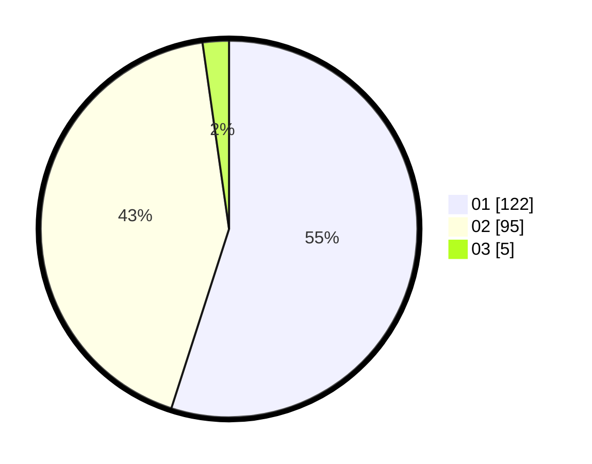

# Hasil

Hasil perolehan suara paslon dapat dilihat pada file paslon-01.txt, paslon-02.txt, dan paslon-03.txt.

Jika tidak ada, artinya data tersebut belum ada pada SIREKAP.

## Perolehan Suara

 * Paslon 01: **122**.
 * Paslon 02: **95**.
 * Paslon 03: **5**.

## Foto C Plano

https://sirekap-obj-formc.kpu.go.id/5b6d/pemilu/ppwp/31/72/04/10/06/3172041006056-20240214-200811--c731fe49-8635-4cb0-abef-125e20fa8bae.jpg

https://sirekap-obj-formc.kpu.go.id/5b6d/pemilu/ppwp/31/72/04/10/06/3172041006056-20240214-212137--647c15d8-acc4-4211-9bf8-9d4d822472be.jpg

https://sirekap-obj-formc.kpu.go.id/5b6d/pemilu/ppwp/31/72/04/10/06/3172041006056-20240214-212150--bab88b1d-df00-4d7d-8cf9-655c5d09d1f5.jpg

## DATA PEMILIH TETAP

Jumlah pemilih dalam DPT: **288**.
 * L: **142**.
 * P: **146**.

## DATA PENGGUNA HAK PILIH

Jumlah pengguna hak pilih dalam DPT: **224**.
 * L: **109**.
 * P: **115**.

Jumlah pengguna hak pilih dalam DPTb: **2**.
 * L: **1**.
 * P: **1**.

Jumlah pengguna hak pilih dalam DPK: **0**.
 * L: **0**.
 * P: **0**.

Jumlah pengguna hak pilih: **226**.
 * L: **110**.
 * P: **116**.

## JUMLAH SUARA SAH DAN TIDAK SAH

JUMLAH SELURUH SUARA SAH: **222**.

JUMLAH SUARA TIDAK SAH: **4**.

JUMLAH SELURUH SUARA SAH DAN SUARA TIDAK SAH: **226**.
