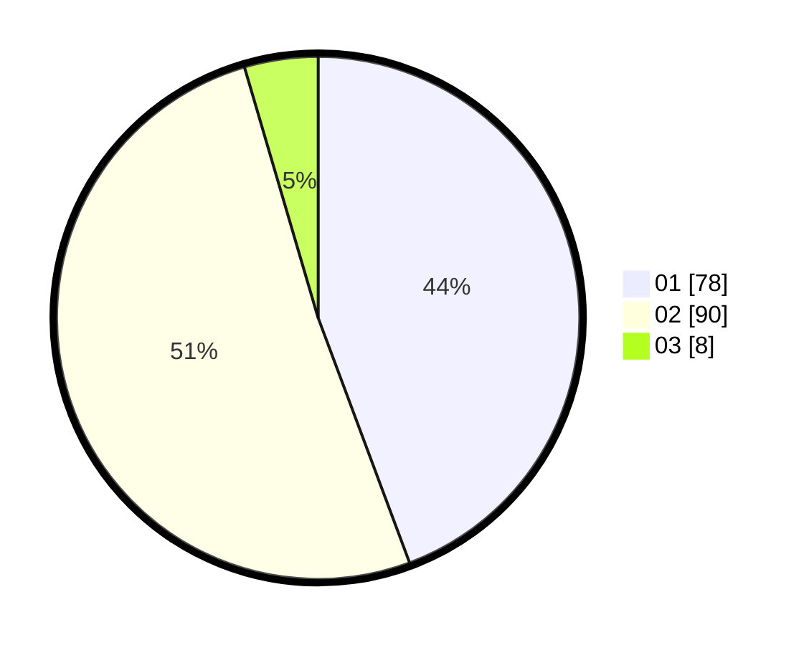

# Hasil

Hasil perolehan suara paslon dapat dilihat pada file paslon-01.txt, paslon-02.txt, dan paslon-03.txt.

Jika tidak ada, artinya data tersebut belum ada pada SIREKAP.

## Perolehan Suara

 * Paslon 01: **78**.
 * Paslon 02: **90**.
 * Paslon 03: **8**.

## Foto C Plano

https://sirekap-obj-formc.kpu.go.id/6f0d/pemilu/ppwp/31/72/04/10/06/3172041006060-20240214-192813--618d8abb-2e0f-40d0-bd2b-cd4695ee85d1.jpg

https://sirekap-obj-formc.kpu.go.id/6f0d/pemilu/ppwp/31/72/04/10/06/3172041006060-20240214-193151--7ed7c164-db67-4875-9b74-ae330bb56d77.jpg

https://sirekap-obj-formc.kpu.go.id/6f0d/pemilu/ppwp/31/72/04/10/06/3172041006060-20240214-193020--450f1357-cdb9-4018-b569-47da9e42af2d.jpg

## DATA PEMILIH TETAP

Jumlah pemilih dalam DPT: **221**.
 * L: **108**.
 * P: **113**.

## DATA PENGGUNA HAK PILIH

Jumlah pengguna hak pilih dalam DPT: **174**.
 * L: **86**.
 * P: **88**.

Jumlah pengguna hak pilih dalam DPTb: **2**.
 * L: **1**.
 * P: **1**.

Jumlah pengguna hak pilih dalam DPK: **0**.
 * L: **0**.
 * P: **0**.

Jumlah pengguna hak pilih: **176**.
 * L: **87**.
 * P: **89**.

## JUMLAH SUARA SAH DAN TIDAK SAH

JUMLAH SELURUH SUARA SAH: **176**.

JUMLAH SUARA TIDAK SAH: **0**.

JUMLAH SELURUH SUARA SAH DAN SUARA TIDAK SAH: **226**.
