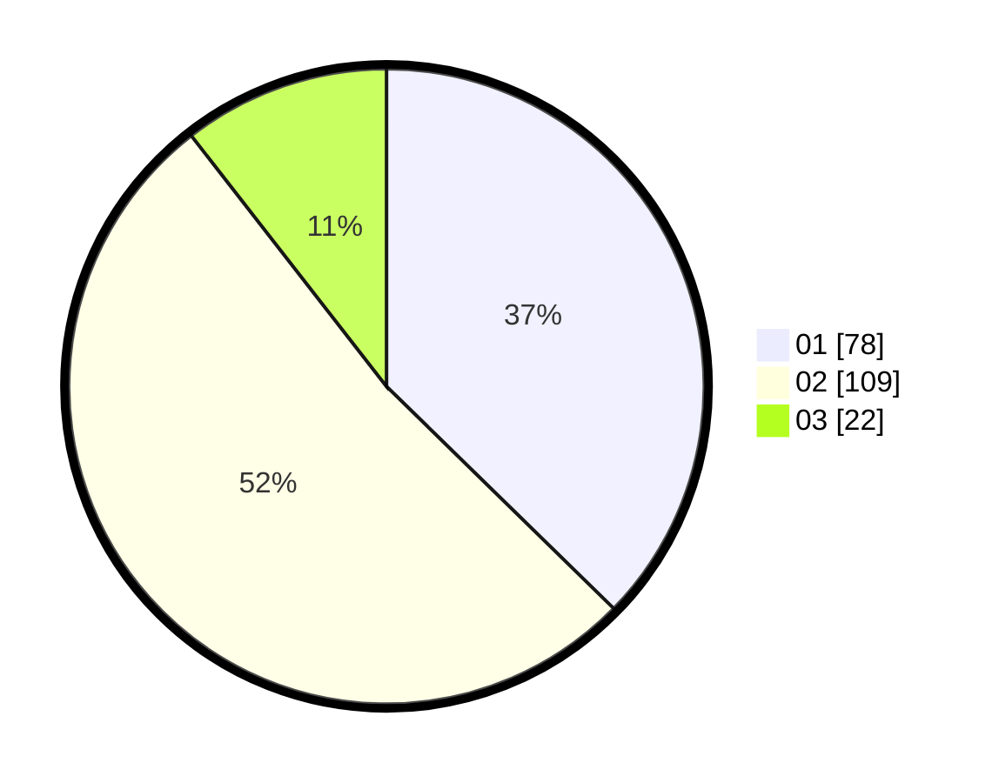

# Hasil

Hasil perolehan suara paslon dapat dilihat pada file paslon-01.txt, paslon-02.txt, dan paslon-03.txt.

Jika tidak ada, artinya data tersebut belum ada pada SIREKAP.

## Perolehan Suara

 * Paslon 01: **78**.
 * Paslon 02: **109**.
 * Paslon 03: **22**.

## Foto C Plano

https://sirekap-obj-formc.kpu.go.id/1af4/pemilu/ppwp/31/72/04/10/06/3172041006073-20240214-205206--3ec08634-4eb5-411d-acd6-c4a1f65de1cd.jpg

https://sirekap-obj-formc.kpu.go.id/1af4/pemilu/ppwp/31/72/04/10/06/3172041006073-20240214-200211--2fcf8630-5d7c-451e-84ac-c785e9e62884.jpg

https://sirekap-obj-formc.kpu.go.id/1af4/pemilu/ppwp/31/72/04/10/06/3172041006073-20240214-194712--c0e9d3cd-8fdb-4349-b87a-1289875317f9.jpg

## DATA PEMILIH TETAP

Jumlah pemilih dalam DPT: **285**.
 * L: **140**.
 * P: **145**.

## DATA PENGGUNA HAK PILIH

Jumlah pengguna hak pilih dalam DPT: **201**.
 * L: **95**.
 * P: **106**.

Jumlah pengguna hak pilih dalam DPTb: **1**.
 * L: **1**.
 * P: **0**.

Jumlah pengguna hak pilih dalam DPK: **9**.
 * L: **5**.
 * P: **4**.

Jumlah pengguna hak pilih: **211**.
 * L: **101**.
 * P: **110**.

## JUMLAH SUARA SAH DAN TIDAK SAH

JUMLAH SELURUH SUARA SAH: **209**.

JUMLAH SUARA TIDAK SAH: **2**.

JUMLAH SELURUH SUARA SAH DAN SUARA TIDAK SAH: **211**.
