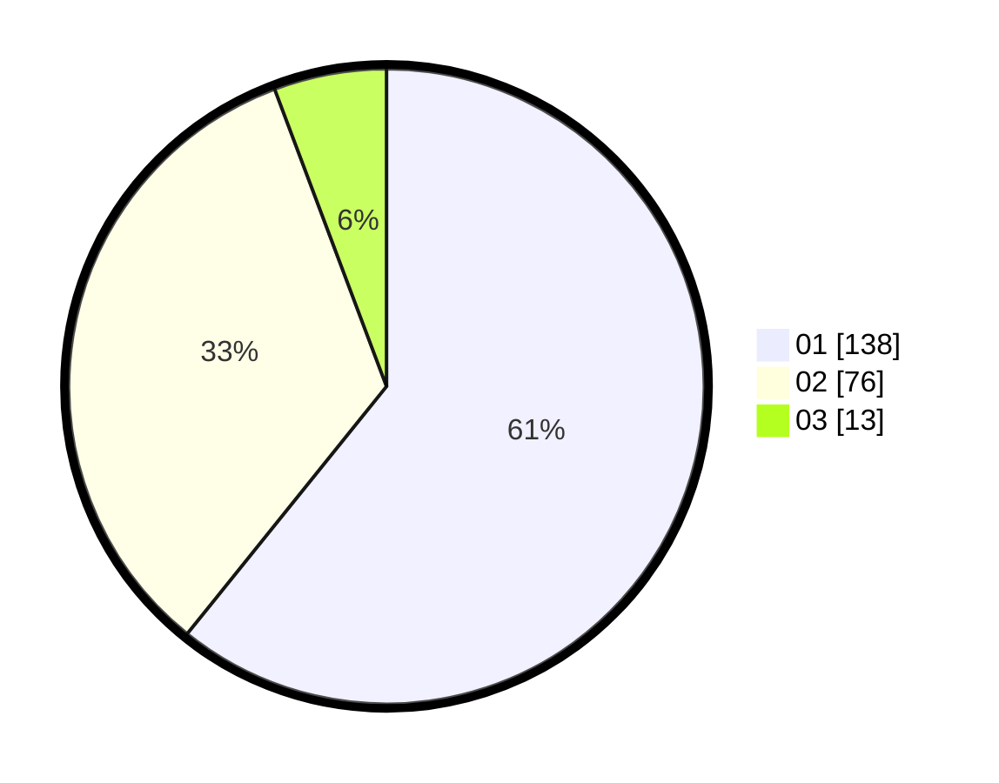

# Hasil

Hasil perolehan suara paslon dapat dilihat pada file paslon-01.txt, paslon-02.txt, dan paslon-03.txt.

Jika tidak ada, artinya data tersebut belum ada pada SIREKAP.

## Perolehan Suara

 * Paslon 01: **138**.
 * Paslon 02: **76**.
 * Paslon 03: **13**.

## Foto C Plano

https://sirekap-obj-formc.kpu.go.id/1862/pemilu/ppwp/31/72/04/10/06/3172041006075-20240214-185020--caafead7-4748-455f-8646-cd282d5b4b05.jpg

https://sirekap-obj-formc.kpu.go.id/1862/pemilu/ppwp/31/72/04/10/06/3172041006075-20240214-185023--aad2ae2b-a58c-4ca0-ad83-4d6b881f38b9.jpg

https://sirekap-obj-formc.kpu.go.id/1862/pemilu/ppwp/31/72/04/10/06/3172041006075-20240214-185029--ec371406-ae89-4928-9f91-c95dcee8ed4f.jpg

## DATA PEMILIH TETAP

Jumlah pemilih dalam DPT: **274**.
 * L: **128**.
 * P: **146**.

## DATA PENGGUNA HAK PILIH

Jumlah pengguna hak pilih dalam DPT: **230**.
 * L: **99**.
 * P: **131**.

Jumlah pengguna hak pilih dalam DPTb: **1**.
 * L: **0**.
 * P: **1**.

Jumlah pengguna hak pilih dalam DPK: **0**.
 * L: **0**.
 * P: **0**.

Jumlah pengguna hak pilih: **231**.
 * L: **99**.
 * P: **132**.

## JUMLAH SUARA SAH DAN TIDAK SAH

JUMLAH SELURUH SUARA SAH: **227**.

JUMLAH SUARA TIDAK SAH: **4**.

JUMLAH SELURUH SUARA SAH DAN SUARA TIDAK SAH: **231**.
