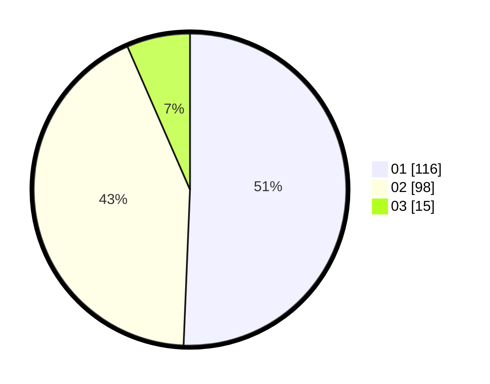

# Hasil

Hasil perolehan suara paslon dapat dilihat pada file paslon-01.txt, paslon-02.txt, dan paslon-03.txt.

Jika tidak ada, artinya data tersebut belum ada pada SIREKAP.

## Perolehan Suara

 * Paslon 01: **116**.
 * Paslon 02: **98**.
 * Paslon 03: **15**.

## Foto C Plano

https://sirekap-obj-formc.kpu.go.id/5025/pemilu/ppwp/31/72/04/10/06/3172041006079-20240214-205715--29305723-53bb-4a2b-ba60-79724193eef7.jpg

https://sirekap-obj-formc.kpu.go.id/5025/pemilu/ppwp/31/72/04/10/06/3172041006079-20240214-225947--d7098947-b662-42ca-8299-f1080be30070.jpg

https://sirekap-obj-formc.kpu.go.id/5025/pemilu/ppwp/31/72/04/10/06/3172041006079-20240214-210147--86e0f86f-a332-4a48-a138-d4c8fe42b26c.jpg

## DATA PEMILIH TETAP

Jumlah pemilih dalam DPT: **265**.
 * L: **122**.
 * P: **143**.

## DATA PENGGUNA HAK PILIH

Jumlah pengguna hak pilih dalam DPT: **223**.
 * L: **98**.
 * P: **125**.

Jumlah pengguna hak pilih dalam DPTb: **3**.
 * L: **3**.
 * P: **0**.

Jumlah pengguna hak pilih dalam DPK: **5**.
 * L: **3**.
 * P: **2**.

Jumlah pengguna hak pilih: **231**.
 * L: **104**.
 * P: **127**.

## JUMLAH SUARA SAH DAN TIDAK SAH

JUMLAH SELURUH SUARA SAH: **229**.

JUMLAH SUARA TIDAK SAH: **1**.

JUMLAH SELURUH SUARA SAH DAN SUARA TIDAK SAH: **230**.
