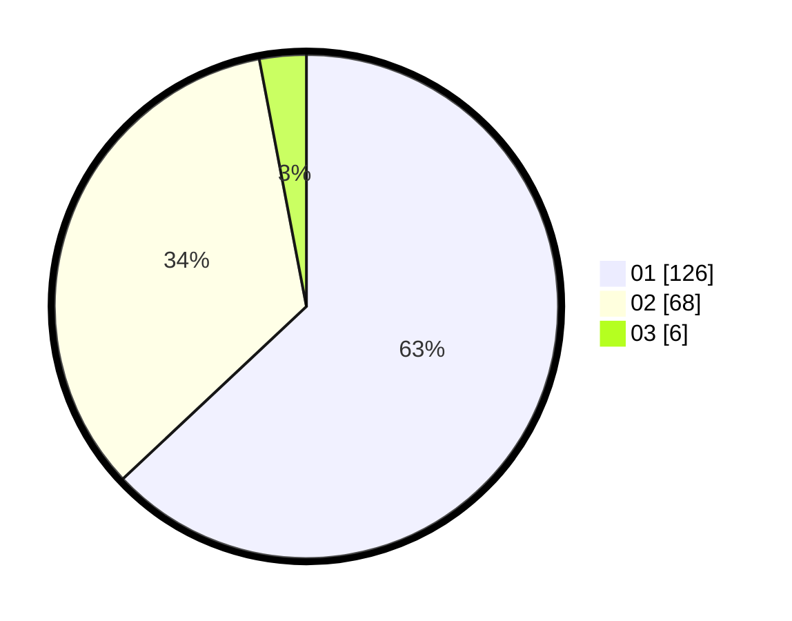

# Hasil

Hasil perolehan suara paslon dapat dilihat pada file paslon-01.txt, paslon-02.txt, dan paslon-03.txt.

Jika tidak ada, artinya data tersebut belum ada pada SIREKAP.

## Perolehan Suara

 * Paslon 01: **126**.
 * Paslon 02: **68**.
 * Paslon 03: **6**.

## Foto C Plano

https://sirekap-obj-formc.kpu.go.id/6e33/pemilu/ppwp/31/72/04/10/06/3172041006097-20240214-195417--e6d12d2c-db6e-4304-9926-cd22ce0a793f.jpg

https://sirekap-obj-formc.kpu.go.id/6e33/pemilu/ppwp/31/72/04/10/06/3172041006097-20240214-195726--fc373582-addc-4efa-a807-3f95ad47c581.jpg

https://sirekap-obj-formc.kpu.go.id/6e33/pemilu/ppwp/31/72/04/10/06/3172041006097-20240215-213426--7e3b05cd-56fe-4df2-a105-d8d2cdd777d6.jpg

## DATA PEMILIH TETAP

Jumlah pemilih dalam DPT: **259**.
 * L: **129**.
 * P: **130**.

## DATA PENGGUNA HAK PILIH

Jumlah pengguna hak pilih dalam DPT: **200**.
 * L: **94**.
 * P: **106**.

Jumlah pengguna hak pilih dalam DPTb: **1**.
 * L: **0**.
 * P: **1**.

Jumlah pengguna hak pilih dalam DPK: **1**.
 * L: **0**.
 * P: **1**.

Jumlah pengguna hak pilih: **202**.
 * L: **94**.
 * P: **108**.

## JUMLAH SUARA SAH DAN TIDAK SAH

JUMLAH SELURUH SUARA SAH: **200**.

JUMLAH SUARA TIDAK SAH: **2**.

JUMLAH SELURUH SUARA SAH DAN SUARA TIDAK SAH: **202**.
