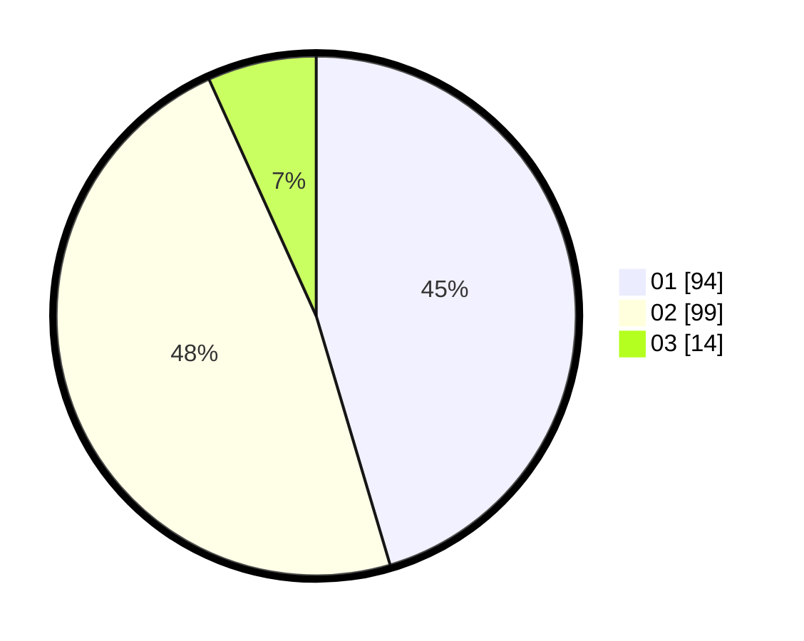

# Hasil

Hasil perolehan suara paslon dapat dilihat pada file paslon-01.txt, paslon-02.txt, dan paslon-03.txt.

Jika tidak ada, artinya data tersebut belum ada pada SIREKAP.

## Perolehan Suara

 * Paslon 01: **94**.
 * Paslon 02: **99**.
 * Paslon 03: **14**.

## Foto C Plano

https://sirekap-obj-formc.kpu.go.id/75ff/pemilu/ppwp/31/72/04/10/06/3172041006106-20240216-203915--f83bb052-1f7e-4295-a8f6-38e40936614e.jpg

https://sirekap-obj-formc.kpu.go.id/75ff/pemilu/ppwp/31/72/04/10/06/3172041006106-20240216-203033--ef67c3c3-a0bf-48e0-9d00-c4eadb10a9b6.jpg

https://sirekap-obj-formc.kpu.go.id/75ff/pemilu/ppwp/31/72/04/10/06/3172041006106-20240216-203423--1bc79378-502b-4258-b067-54229afe6d5f.jpg

## DATA PEMILIH TETAP

Jumlah pemilih dalam DPT: **269**.
 * L: **135**.
 * P: **134**.

## DATA PENGGUNA HAK PILIH

Jumlah pengguna hak pilih dalam DPT: **204**.
 * L: **97**.
 * P: **107**.

Jumlah pengguna hak pilih dalam DPTb: **1**.
 * L: **1**.
 * P: **0**.

Jumlah pengguna hak pilih dalam DPK: **3**.
 * L: **1**.
 * P: **2**.

Jumlah pengguna hak pilih: **208**.
 * L: **99**.
 * P: **109**.

## JUMLAH SUARA SAH DAN TIDAK SAH

JUMLAH SELURUH SUARA SAH: **207**.

JUMLAH SUARA TIDAK SAH: **1**.

JUMLAH SELURUH SUARA SAH DAN SUARA TIDAK SAH: **208**.
