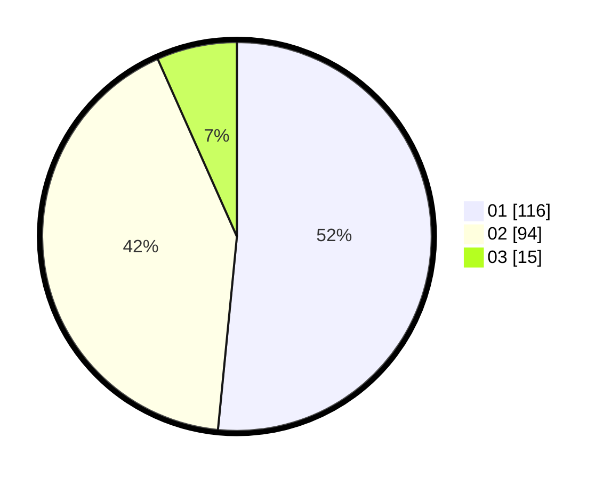

# Hasil

Hasil perolehan suara paslon dapat dilihat pada file paslon-01.txt, paslon-02.txt, dan paslon-03.txt.

Jika tidak ada, artinya data tersebut belum ada pada SIREKAP.

## Perolehan Suara

 * Paslon 01: **116**.
 * Paslon 02: **94**.
 * Paslon 03: **15**.

## Foto C Plano

https://sirekap-obj-formc.kpu.go.id/6606/pemilu/ppwp/31/72/04/10/06/3172041006108-20240214-211109--2d2b8847-f82b-4874-8e5c-5561923983fa.jpg

https://sirekap-obj-formc.kpu.go.id/6606/pemilu/ppwp/31/72/04/10/06/3172041006108-20240214-203907--e4b14587-1952-4fe2-968a-b7cb1b4b5f0d.jpg

https://sirekap-obj-formc.kpu.go.id/6606/pemilu/ppwp/31/72/04/10/06/3172041006108-20240214-211007--50bf9b13-d754-4932-8d1a-e7624537bfa8.jpg

## DATA PEMILIH TETAP

Jumlah pemilih dalam DPT: **266**.
 * L: **130**.
 * P: **136**.

## DATA PENGGUNA HAK PILIH

Jumlah pengguna hak pilih dalam DPT: **226**.
 * L: **107**.
 * P: **119**.

Jumlah pengguna hak pilih dalam DPTb: **1**.
 * L: **0**.
 * P: **1**.

Jumlah pengguna hak pilih dalam DPK: **1**.
 * L: **0**.
 * P: **1**.

Jumlah pengguna hak pilih: **228**.
 * L: **107**.
 * P: **121**.

## JUMLAH SUARA SAH DAN TIDAK SAH

JUMLAH SELURUH SUARA SAH: **225**.

JUMLAH SUARA TIDAK SAH: **3**.

JUMLAH SELURUH SUARA SAH DAN SUARA TIDAK SAH: **228**.
