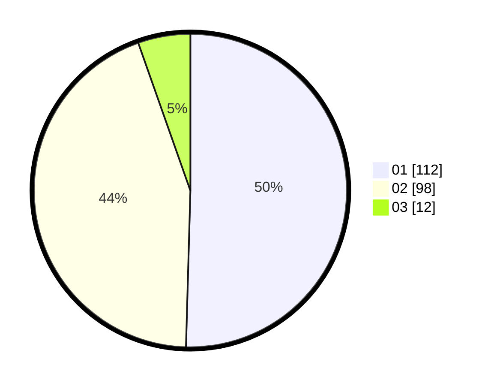

# Hasil

Hasil perolehan suara paslon dapat dilihat pada file paslon-01.txt, paslon-02.txt, dan paslon-03.txt.

Jika tidak ada, artinya data tersebut belum ada pada SIREKAP.

## Perolehan Suara

 * Paslon 01: **112**.
 * Paslon 02: **98**.
 * Paslon 03: **12**.

## Foto C Plano

https://sirekap-obj-formc.kpu.go.id/4470/pemilu/ppwp/31/72/04/10/06/3172041006109-20240214-194333--1df7d0fb-cda7-43ab-8ef5-05ba5a0fdd41.jpg

https://sirekap-obj-formc.kpu.go.id/4470/pemilu/ppwp/31/72/04/10/06/3172041006109-20240214-200906--c9e4c020-5dd1-4510-8a43-60641f8ded7c.jpg

https://sirekap-obj-formc.kpu.go.id/4470/pemilu/ppwp/31/72/04/10/06/3172041006109-20240214-201303--b621065e-b57b-4921-8ca6-174217f8f84a.jpg

## DATA PEMILIH TETAP

Jumlah pemilih dalam DPT: **270**.
 * L: **132**.
 * P: **138**.

## DATA PENGGUNA HAK PILIH

Jumlah pengguna hak pilih dalam DPT: **220**.
 * L: **107**.
 * P: **113**.

Jumlah pengguna hak pilih dalam DPTb: **1**.
 * L: **0**.
 * P: **1**.

Jumlah pengguna hak pilih dalam DPK: **3**.
 * L: **2**.
 * P: **1**.

Jumlah pengguna hak pilih: **224**.
 * L: **109**.
 * P: **115**.

## JUMLAH SUARA SAH DAN TIDAK SAH

JUMLAH SELURUH SUARA SAH: **222**.

JUMLAH SUARA TIDAK SAH: **2**.

JUMLAH SELURUH SUARA SAH DAN SUARA TIDAK SAH: **224**.
