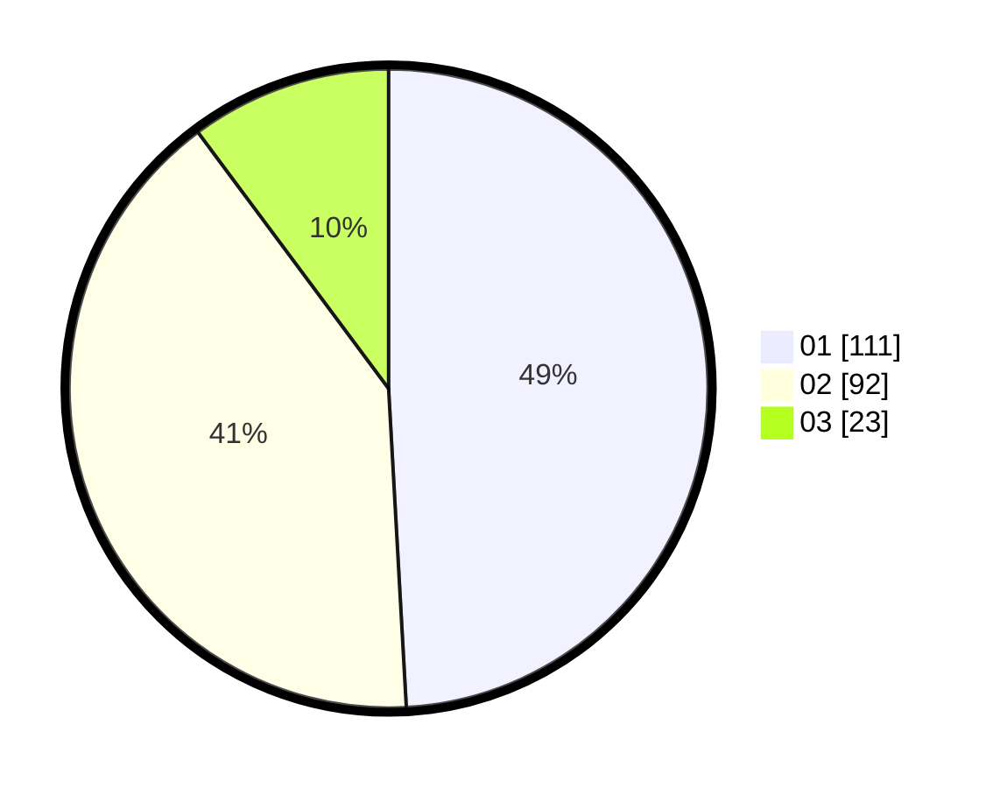

# Hasil

Hasil perolehan suara paslon dapat dilihat pada file paslon-01.txt, paslon-02.txt, dan paslon-03.txt.

Jika tidak ada, artinya data tersebut belum ada pada SIREKAP.

## Perolehan Suara

 * Paslon 01: **111**.
 * Paslon 02: **92**.
 * Paslon 03: **23**.

## Foto C Plano

https://sirekap-obj-formc.kpu.go.id/44d4/pemilu/ppwp/31/72/04/10/06/3172041006114-20240216-071215--0ecde108-5f7f-40ca-a67d-fc8f5a9f51d5.jpg

https://sirekap-obj-formc.kpu.go.id/44d4/pemilu/ppwp/31/72/04/10/06/3172041006114-20240216-071218--66685fe6-fb5e-4d26-b2ec-6fba85b92b44.jpg

https://sirekap-obj-formc.kpu.go.id/44d4/pemilu/ppwp/31/72/04/10/06/3172041006114-20240216-071217--9d34730d-cf4e-40a0-bf6b-e2f6f2c77498.jpg

## DATA PEMILIH TETAP

Jumlah pemilih dalam DPT: **267**.
 * L: **135**.
 * P: **132**.

## DATA PENGGUNA HAK PILIH

Jumlah pengguna hak pilih dalam DPT: **218**.
 * L: **106**.
 * P: **112**.

Jumlah pengguna hak pilih dalam DPTb: **2**.
 * L: **1**.
 * P: **1**.

Jumlah pengguna hak pilih dalam DPK: **7**.
 * L: **4**.
 * P: **3**.

Jumlah pengguna hak pilih: **227**.
 * L: **111**.
 * P: **116**.

## JUMLAH SUARA SAH DAN TIDAK SAH

JUMLAH SELURUH SUARA SAH: **226**.

JUMLAH SUARA TIDAK SAH: **1**.

JUMLAH SELURUH SUARA SAH DAN SUARA TIDAK SAH: **227**.
