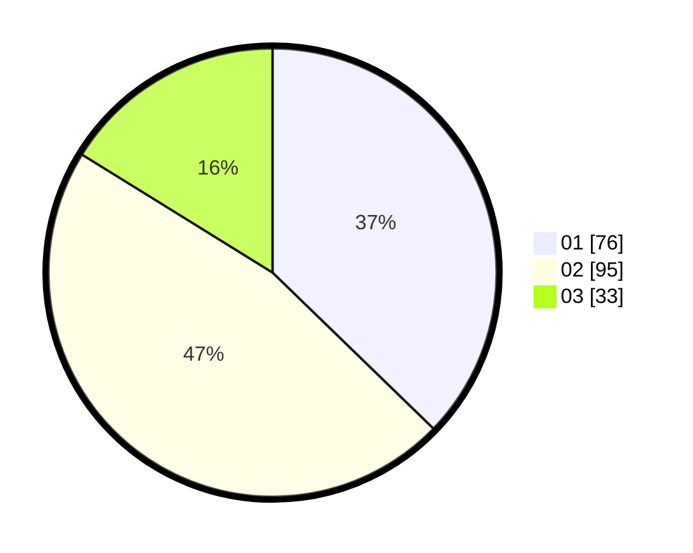

# Hasil

Hasil perolehan suara paslon dapat dilihat pada file paslon-01.txt, paslon-02.txt, dan paslon-03.txt.

Jika tidak ada, artinya data tersebut belum ada pada SIREKAP.

## Perolehan Suara

 * Paslon 01: **76**.
 * Paslon 02: **95**.
 * Paslon 03: **33**.

## Foto C Plano

https://sirekap-obj-formc.kpu.go.id/9f15/pemilu/ppwp/31/72/04/10/06/3172041006115-20240214-155355--533a13e6-a72a-4c35-b2c9-b24cfdaef291.jpg

https://sirekap-obj-formc.kpu.go.id/9f15/pemilu/ppwp/31/72/04/10/06/3172041006115-20240214-155656--86d36576-a74c-4b96-8a8f-e9040c2b3687.jpg

https://sirekap-obj-formc.kpu.go.id/9f15/pemilu/ppwp/31/72/04/10/06/3172041006115-20240214-155927--2be021e4-a7c8-4fd8-b816-42d6d166f681.jpg

## DATA PEMILIH TETAP

Jumlah pemilih dalam DPT: **267**.
 * L: **143**.
 * P: **124**.

## DATA PENGGUNA HAK PILIH

Jumlah pengguna hak pilih dalam DPT: **200**.
 * L: **100**.
 * P: **100**.

Jumlah pengguna hak pilih dalam DPTb: **3**.
 * L: **0**.
 * P: **3**.

Jumlah pengguna hak pilih dalam DPK: **2**.
 * L: **1**.
 * P: **1**.

Jumlah pengguna hak pilih: **205**.
 * L: **101**.
 * P: **104**.

## JUMLAH SUARA SAH DAN TIDAK SAH

JUMLAH SELURUH SUARA SAH: **204**.

JUMLAH SUARA TIDAK SAH: **1**.

JUMLAH SELURUH SUARA SAH DAN SUARA TIDAK SAH: **205**.
