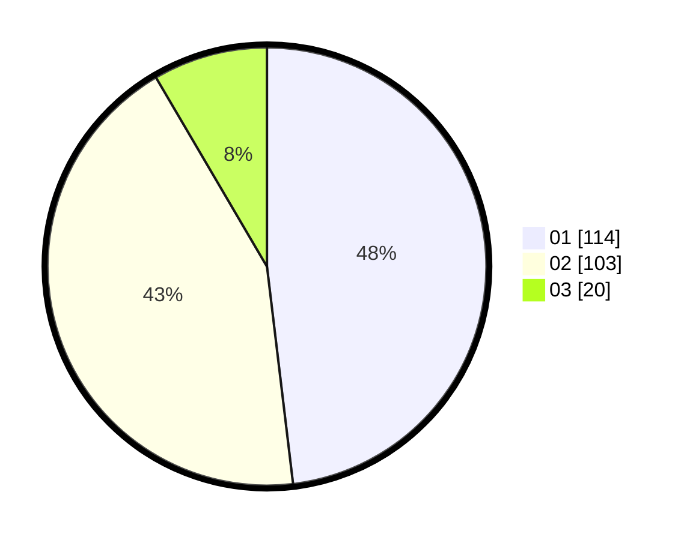

# Hasil

Hasil perolehan suara paslon dapat dilihat pada file paslon-01.txt, paslon-02.txt, dan paslon-03.txt.

Jika tidak ada, artinya data tersebut belum ada pada SIREKAP.

## Perolehan Suara

 * Paslon 01: **114**.
 * Paslon 02: **103**.
 * Paslon 03: **20**.

## Foto C Plano

https://sirekap-obj-formc.kpu.go.id/c961/pemilu/ppwp/31/72/04/10/06/3172041006120-20240214-195644--67d00a57-0273-4ea2-bd17-6a8d197a3aa5.jpg

https://sirekap-obj-formc.kpu.go.id/c961/pemilu/ppwp/31/72/04/10/06/3172041006120-20240214-200243--b11f5f94-6f08-44af-b6bd-62a08103ca7c.jpg

https://sirekap-obj-formc.kpu.go.id/c961/pemilu/ppwp/31/72/04/10/06/3172041006120-20240214-200104--04432b80-d5f5-4405-ac79-d11246cb8e53.jpg

## DATA PEMILIH TETAP

Jumlah pemilih dalam DPT: **293**.
 * L: **144**.
 * P: **149**.

## DATA PENGGUNA HAK PILIH

Jumlah pengguna hak pilih dalam DPT: **232**.
 * L: **111**.
 * P: **121**.

Jumlah pengguna hak pilih dalam DPTb: **1**.
 * L: **0**.
 * P: **1**.

Jumlah pengguna hak pilih dalam DPK: **6**.
 * L: **3**.
 * P: **3**.

Jumlah pengguna hak pilih: **239**.
 * L: **114**.
 * P: **125**.

## JUMLAH SUARA SAH DAN TIDAK SAH

JUMLAH SELURUH SUARA SAH: **237**.

JUMLAH SUARA TIDAK SAH: **2**.

JUMLAH SELURUH SUARA SAH DAN SUARA TIDAK SAH: **239**.
