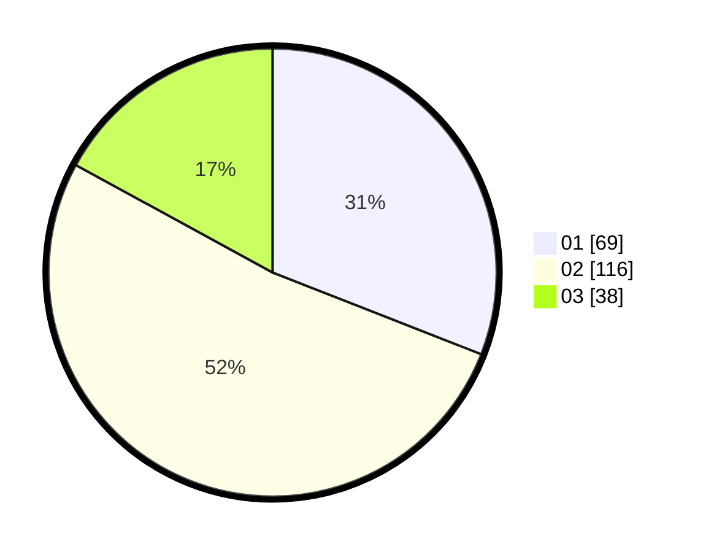

# Hasil

Hasil perolehan suara paslon dapat dilihat pada file paslon-01.txt, paslon-02.txt, dan paslon-03.txt.

Jika tidak ada, artinya data tersebut belum ada pada SIREKAP.

## Perolehan Suara

 * Paslon 01: **69**.
 * Paslon 02: **116**.
 * Paslon 03: **38**.

## Foto C Plano

https://sirekap-obj-formc.kpu.go.id/807e/pemilu/ppwp/31/72/04/10/06/3172041006137-20240214-155116--f4cf6db5-b7f7-431c-937f-719792d18ee8.jpg

https://sirekap-obj-formc.kpu.go.id/807e/pemilu/ppwp/31/72/04/10/06/3172041006137-20240214-155122--fc75afe0-75bf-4ea7-802b-5effe56ff25a.jpg

https://sirekap-obj-formc.kpu.go.id/807e/pemilu/ppwp/31/72/04/10/06/3172041006137-20240214-155126--e9668e95-020d-4c92-843c-221d43460e9b.jpg

## DATA PEMILIH TETAP

Jumlah pemilih dalam DPT: **282**.
 * L: **137**.
 * P: **145**.

## DATA PENGGUNA HAK PILIH

Jumlah pengguna hak pilih dalam DPT: **220**.
 * L: **103**.
 * P: **117**.

Jumlah pengguna hak pilih dalam DPTb: **1**.
 * L: **0**.
 * P: **1**.

Jumlah pengguna hak pilih dalam DPK: **7**.
 * L: **4**.
 * P: **3**.

Jumlah pengguna hak pilih: **228**.
 * L: **107**.
 * P: **121**.

## JUMLAH SUARA SAH DAN TIDAK SAH

JUMLAH SELURUH SUARA SAH: **223**.

JUMLAH SUARA TIDAK SAH: **5**.

JUMLAH SELURUH SUARA SAH DAN SUARA TIDAK SAH: **228**.
