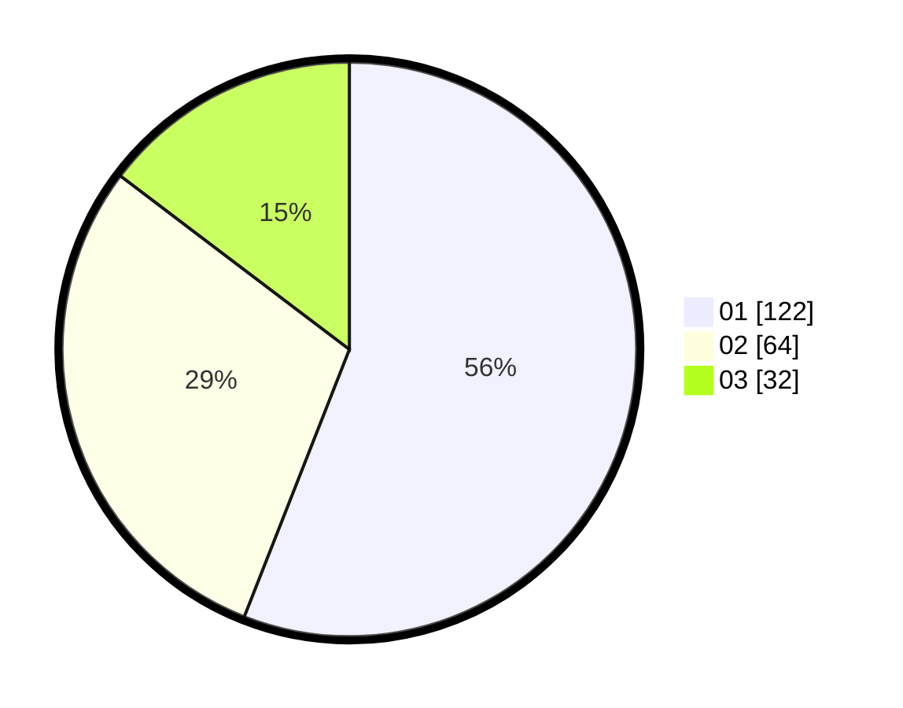

# Hasil

Hasil perolehan suara paslon dapat dilihat pada file paslon-01.txt, paslon-02.txt, dan paslon-03.txt.

Jika tidak ada, artinya data tersebut belum ada pada SIREKAP.

## Perolehan Suara

 * Paslon 01: **122**.
 * Paslon 02: **64**.
 * Paslon 03: **32**.

## Foto C Plano

https://sirekap-obj-formc.kpu.go.id/2201/pemilu/ppwp/31/72/04/10/07/3172041007001-20240214-202259--8ddbd025-278f-4df3-b1ba-e44e5946a3cc.jpg

https://sirekap-obj-formc.kpu.go.id/2201/pemilu/ppwp/31/72/04/10/07/3172041007001-20240214-202409--b59a42ad-e290-488b-a325-5d0e767e2adb.jpg

https://sirekap-obj-formc.kpu.go.id/2201/pemilu/ppwp/31/72/04/10/07/3172041007001-20240214-202459--7022b6fc-f5ac-4fa7-9998-8b4f68c899c9.jpg

## DATA PEMILIH TETAP

Jumlah pemilih dalam DPT: **296**.
 * L: **145**.
 * P: **151**.

## DATA PENGGUNA HAK PILIH

Jumlah pengguna hak pilih dalam DPT: **217**.
 * L: **109**.
 * P: **108**.

Jumlah pengguna hak pilih dalam DPTb: **0**.
 * L: **0**.
 * P: **0**.

Jumlah pengguna hak pilih dalam DPK: **1**.
 * L: **1**.
 * P: **0**.

Jumlah pengguna hak pilih: **218**.
 * L: **110**.
 * P: **108**.

## JUMLAH SUARA SAH DAN TIDAK SAH

JUMLAH SELURUH SUARA SAH: **218**.

JUMLAH SUARA TIDAK SAH: **0**.

JUMLAH SELURUH SUARA SAH DAN SUARA TIDAK SAH: **218**.
