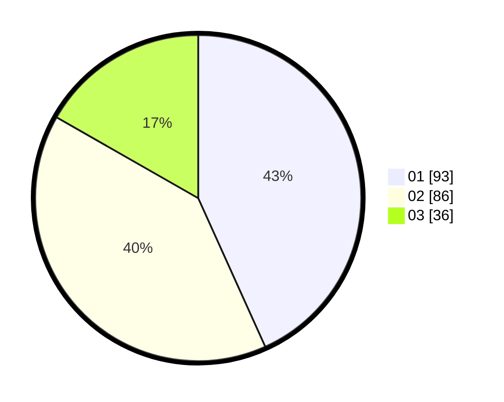

# Hasil

Hasil perolehan suara paslon dapat dilihat pada file paslon-01.txt, paslon-02.txt, dan paslon-03.txt.

Jika tidak ada, artinya data tersebut belum ada pada SIREKAP.

## Perolehan Suara

 * Paslon 01: **93**.
 * Paslon 02: **86**.
 * Paslon 03: **36**.

## Foto C Plano

https://sirekap-obj-formc.kpu.go.id/d5ce/pemilu/ppwp/31/72/04/10/07/3172041007007-20240215-095159--7d1062c2-8a36-45c9-8da0-143786e9f28c.jpg

https://sirekap-obj-formc.kpu.go.id/d5ce/pemilu/ppwp/31/72/04/10/07/3172041007007-20240214-193650--53970a86-7cff-47e3-badf-fec101ea3b20.jpg

https://sirekap-obj-formc.kpu.go.id/d5ce/pemilu/ppwp/31/72/04/10/07/3172041007007-20240214-181305--5701b222-72c6-4955-923e-249c822f4163.jpg

## DATA PEMILIH TETAP

Jumlah pemilih dalam DPT: **0**.
 * L: **0**.
 * P: **0**.

## DATA PENGGUNA HAK PILIH

Jumlah pengguna hak pilih dalam DPT: **0**.
 * L: **0**.
 * P: **0**.

Jumlah pengguna hak pilih dalam DPTb: **0**.
 * L: **0**.
 * P: **0**.

Jumlah pengguna hak pilih dalam DPK: **0**.
 * L: **0**.
 * P: **0**.

Jumlah pengguna hak pilih: **0**.
 * L: **0**.
 * P: **0**.

## JUMLAH SUARA SAH DAN TIDAK SAH

JUMLAH SELURUH SUARA SAH: **215**.

JUMLAH SUARA TIDAK SAH: **5**.

JUMLAH SELURUH SUARA SAH DAN SUARA TIDAK SAH: **220**.
