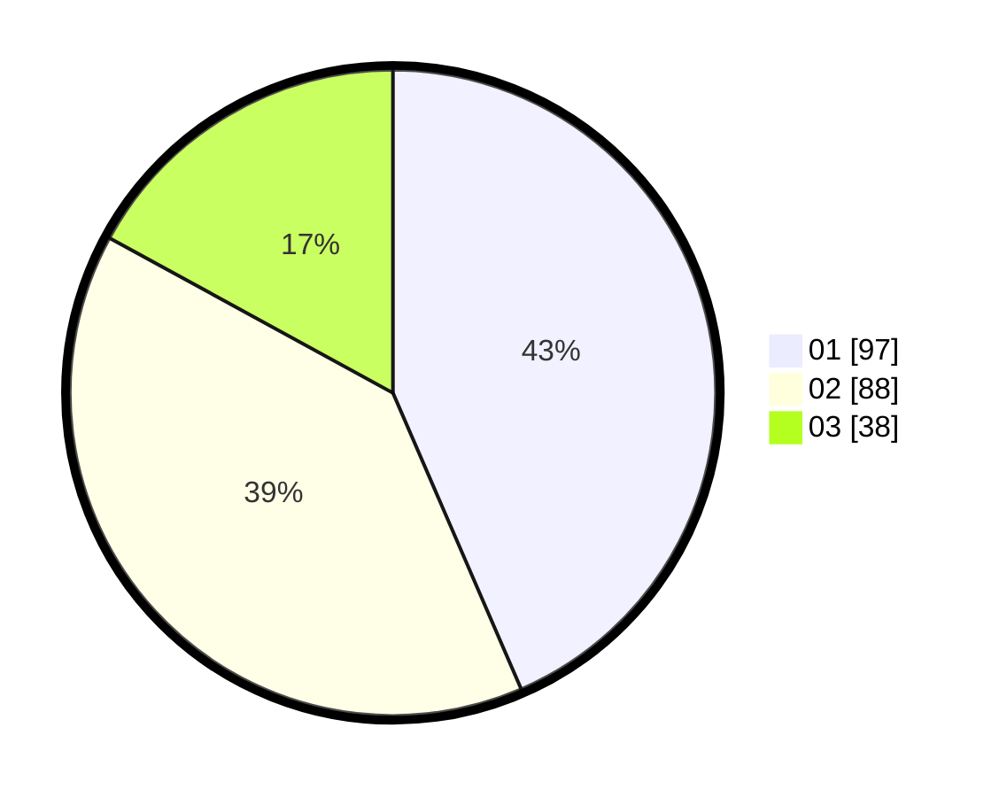

# Hasil

Hasil perolehan suara paslon dapat dilihat pada file paslon-01.txt, paslon-02.txt, dan paslon-03.txt.

Jika tidak ada, artinya data tersebut belum ada pada SIREKAP.

## Perolehan Suara

 * Paslon 01: **97**.
 * Paslon 02: **88**.
 * Paslon 03: **38**.

## Foto C Plano

https://sirekap-obj-formc.kpu.go.id/26aa/pemilu/ppwp/31/72/04/10/07/3172041007015-20240216-135450--e95291a3-eea8-4908-b158-91610ebd1314.jpg

https://sirekap-obj-formc.kpu.go.id/26aa/pemilu/ppwp/31/72/04/10/07/3172041007015-20240216-135451--5edd2b23-f492-4fdd-a2a1-8653682fb540.jpg

https://sirekap-obj-formc.kpu.go.id/26aa/pemilu/ppwp/31/72/04/10/07/3172041007015-20240216-135450--f2ccad2d-76bf-4616-b13a-63fb65d0084b.jpg

## DATA PEMILIH TETAP

Jumlah pemilih dalam DPT: **290**.
 * L: **142**.
 * P: **148**.

## DATA PENGGUNA HAK PILIH

Jumlah pengguna hak pilih dalam DPT: **219**.
 * L: **101**.
 * P: **118**.

Jumlah pengguna hak pilih dalam DPTb: **6**.
 * L: **3**.
 * P: **3**.

Jumlah pengguna hak pilih dalam DPK: **1**.
 * L: **0**.
 * P: **1**.

Jumlah pengguna hak pilih: **226**.
 * L: **104**.
 * P: **122**.

## JUMLAH SUARA SAH DAN TIDAK SAH

JUMLAH SELURUH SUARA SAH: **223**.

JUMLAH SUARA TIDAK SAH: **3**.

JUMLAH SELURUH SUARA SAH DAN SUARA TIDAK SAH: **226**.
