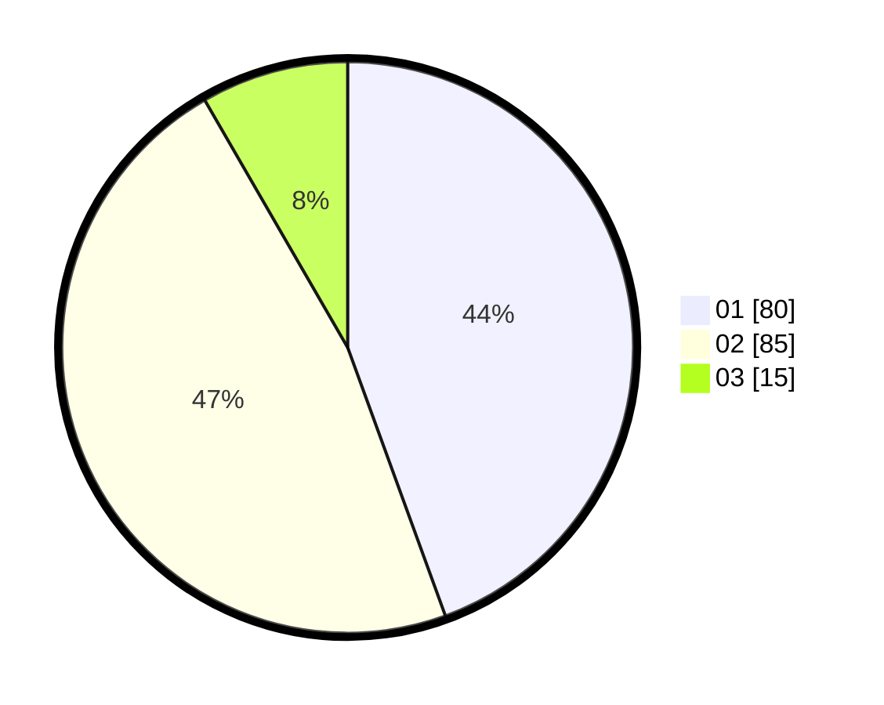

# Hasil

Hasil perolehan suara paslon dapat dilihat pada file paslon-01.txt, paslon-02.txt, dan paslon-03.txt.

Jika tidak ada, artinya data tersebut belum ada pada SIREKAP.

## Perolehan Suara

 * Paslon 01: **80**.
 * Paslon 02: **85**.
 * Paslon 03: **15**.

## Foto C Plano

https://sirekap-obj-formc.kpu.go.id/b1c1/pemilu/ppwp/31/72/04/10/07/3172041007021-20240214-214101--cc48dca4-d0e8-416c-be4c-5afaa88b6505.jpg

https://sirekap-obj-formc.kpu.go.id/b1c1/pemilu/ppwp/31/72/04/10/07/3172041007021-20240214-213829--030c1f71-9f8e-44ea-a5a3-9b626622ff99.jpg

https://sirekap-obj-formc.kpu.go.id/b1c1/pemilu/ppwp/31/72/04/10/07/3172041007021-20240214-214111--b86904b1-fbce-4615-bf24-340f0af17321.jpg

## DATA PEMILIH TETAP

Jumlah pemilih dalam DPT: **240**.
 * L: **124**.
 * P: **116**.

## DATA PENGGUNA HAK PILIH

Jumlah pengguna hak pilih dalam DPT: **181**.
 * L: **84**.
 * P: **97**.

Jumlah pengguna hak pilih dalam DPTb: **0**.
 * L: **0**.
 * P: **0**.

Jumlah pengguna hak pilih dalam DPK: **0**.
 * L: **0**.
 * P: **0**.

Jumlah pengguna hak pilih: **181**.
 * L: **84**.
 * P: **97**.

## JUMLAH SUARA SAH DAN TIDAK SAH

JUMLAH SELURUH SUARA SAH: **181**.

JUMLAH SUARA TIDAK SAH: **0**.

JUMLAH SELURUH SUARA SAH DAN SUARA TIDAK SAH: **181**.
