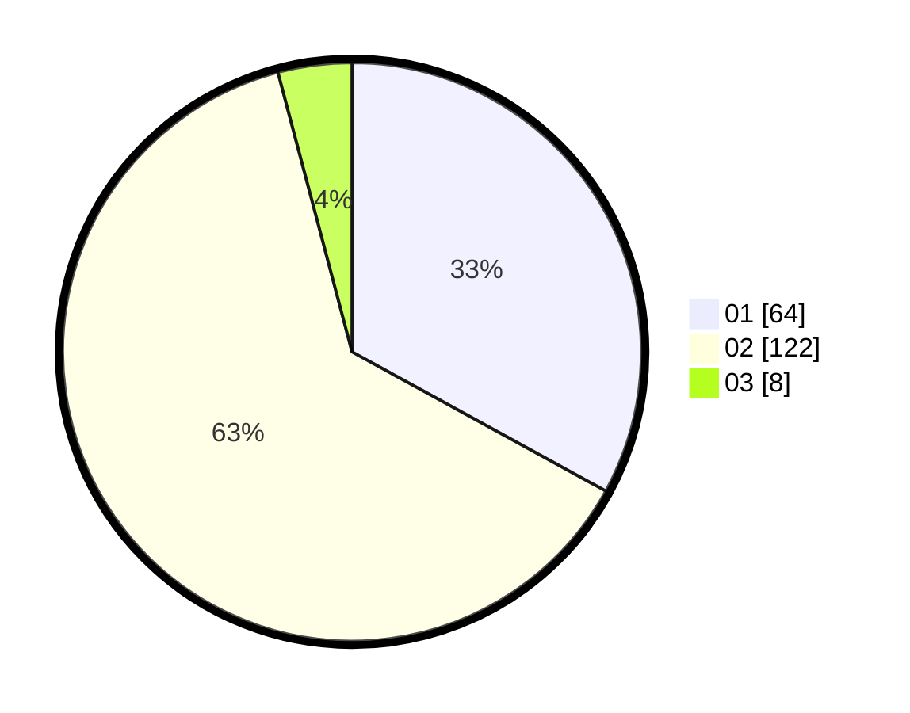

# Hasil

Hasil perolehan suara paslon dapat dilihat pada file paslon-01.txt, paslon-02.txt, dan paslon-03.txt.

Jika tidak ada, artinya data tersebut belum ada pada SIREKAP.

## Perolehan Suara

 * Paslon 01: **64**.
 * Paslon 02: **122**.
 * Paslon 03: **8**.

## Foto C Plano

https://sirekap-obj-formc.kpu.go.id/62be/pemilu/ppwp/31/72/04/10/07/3172041007037-20240214-190652--067d181d-09cc-4d83-9618-c57a186253b5.jpg

https://sirekap-obj-formc.kpu.go.id/62be/pemilu/ppwp/31/72/04/10/07/3172041007037-20240214-200457--d08e8a95-1117-417a-b306-906cd2f20d01.jpg

https://sirekap-obj-formc.kpu.go.id/62be/pemilu/ppwp/31/72/04/10/07/3172041007037-20240214-215139--2709ac17-5034-4a4c-b901-25a14193a6d1.jpg

## DATA PEMILIH TETAP

Jumlah pemilih dalam DPT: **192**.
 * L: **77**.
 * P: **115**.

## DATA PENGGUNA HAK PILIH

Jumlah pengguna hak pilih dalam DPT: **271**.
 * L: **113**.
 * P: **158**.

Jumlah pengguna hak pilih dalam DPTb: **0**.
 * L: **0**.
 * P: **0**.

Jumlah pengguna hak pilih dalam DPK: **2**.
 * L: **0**.
 * P: **2**.

Jumlah pengguna hak pilih: **273**.
 * L: **113**.
 * P: **160**.

## JUMLAH SUARA SAH DAN TIDAK SAH

JUMLAH SELURUH SUARA SAH: **194**.

JUMLAH SUARA TIDAK SAH: **0**.

JUMLAH SELURUH SUARA SAH DAN SUARA TIDAK SAH: **194**.
