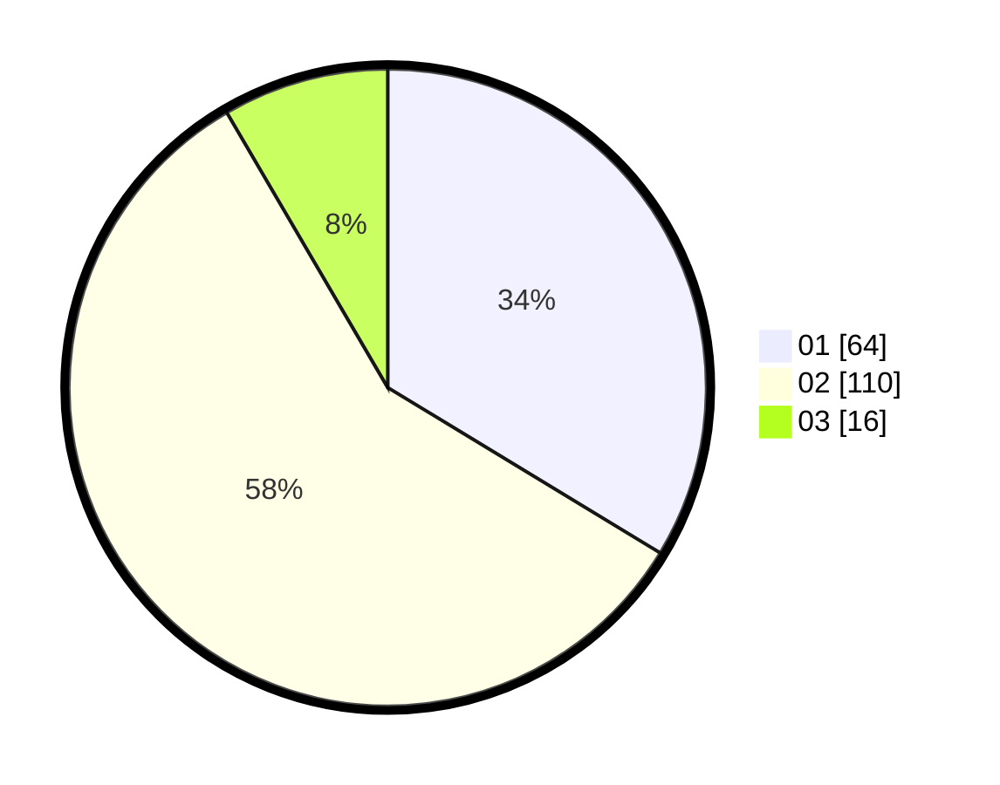

# Hasil

Hasil perolehan suara paslon dapat dilihat pada file paslon-01.txt, paslon-02.txt, dan paslon-03.txt.

Jika tidak ada, artinya data tersebut belum ada pada SIREKAP.

## Perolehan Suara

 * Paslon 01: **64**.
 * Paslon 02: **110**.
 * Paslon 03: **16**.

## Foto C Plano

https://sirekap-obj-formc.kpu.go.id/d33a/pemilu/ppwp/31/72/04/10/07/3172041007039-20240214-184845--7c2fe581-e13f-4f6a-a314-7267c79dce96.jpg

https://sirekap-obj-formc.kpu.go.id/d33a/pemilu/ppwp/31/72/04/10/07/3172041007039-20240214-184850--8f834cb3-9f92-4613-b9ee-21df12a3031b.jpg

https://sirekap-obj-formc.kpu.go.id/d33a/pemilu/ppwp/31/72/04/10/07/3172041007039-20240214-184856--0d8aa0ec-7617-4a5c-8cd3-bde706fcc22f.jpg

## DATA PEMILIH TETAP

Jumlah pemilih dalam DPT: **286**.
 * L: **147**.
 * P: **139**.

## DATA PENGGUNA HAK PILIH

Jumlah pengguna hak pilih dalam DPT: **210**.
 * L: **100**.
 * P: **110**.

Jumlah pengguna hak pilih dalam DPTb: **0**.
 * L: **0**.
 * P: **0**.

Jumlah pengguna hak pilih dalam DPK: **1**.
 * L: **0**.
 * P: **1**.

Jumlah pengguna hak pilih: **211**.
 * L: **100**.
 * P: **111**.

## JUMLAH SUARA SAH DAN TIDAK SAH

JUMLAH SELURUH SUARA SAH: **190**.

JUMLAH SUARA TIDAK SAH: **21**.

JUMLAH SELURUH SUARA SAH DAN SUARA TIDAK SAH: **211**.
