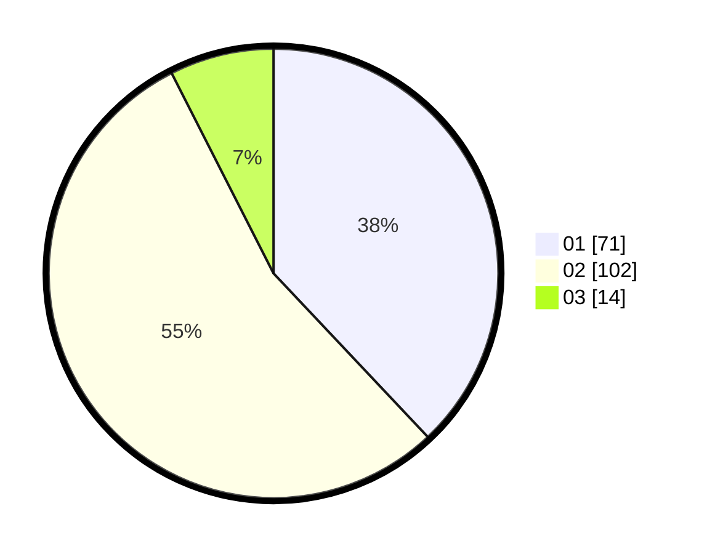

# Hasil

Hasil perolehan suara paslon dapat dilihat pada file paslon-01.txt, paslon-02.txt, dan paslon-03.txt.

Jika tidak ada, artinya data tersebut belum ada pada SIREKAP.

## Perolehan Suara

 * Paslon 01: **71**.
 * Paslon 02: **102**.
 * Paslon 03: **14**.

## Foto C Plano

https://sirekap-obj-formc.kpu.go.id/de29/pemilu/ppwp/31/72/04/10/07/3172041007040-20240214-200717--620a9df6-b07e-4514-b26d-8bd1abb7ad53.jpg

https://sirekap-obj-formc.kpu.go.id/de29/pemilu/ppwp/31/72/04/10/07/3172041007040-20240214-222107--ea1cb3a7-413e-42da-8a01-8349821ed448.jpg

https://sirekap-obj-formc.kpu.go.id/de29/pemilu/ppwp/31/72/04/10/07/3172041007040-20240214-222251--b91cfc78-8b4c-4503-bf55-aa493d45b294.jpg
