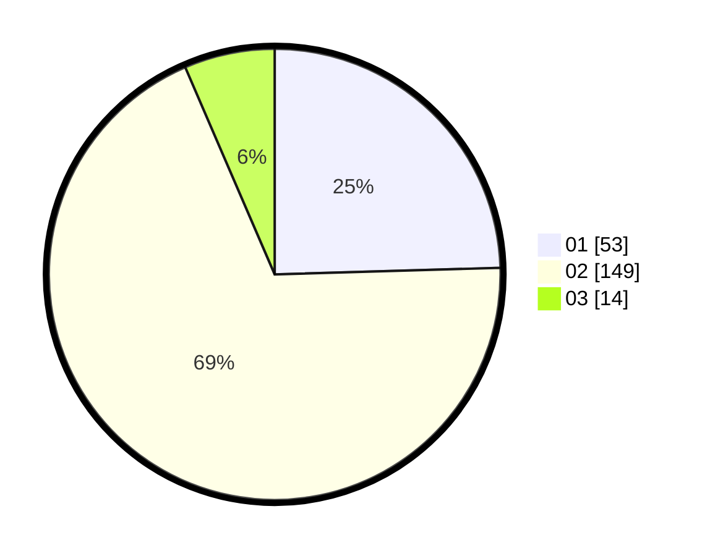

# Hasil

Hasil perolehan suara paslon dapat dilihat pada file paslon-01.txt, paslon-02.txt, dan paslon-03.txt.

Jika tidak ada, artinya data tersebut belum ada pada SIREKAP.

## Perolehan Suara

 * Paslon 01: **53**.
 * Paslon 02: **149**.
 * Paslon 03: **14**.

## Foto C Plano

https://sirekap-obj-formc.kpu.go.id/ec1c/pemilu/ppwp/31/72/04/10/07/3172041007042-20240214-210819--01124646-b5eb-43ea-a31d-f04675319b13.jpg

https://sirekap-obj-formc.kpu.go.id/ec1c/pemilu/ppwp/31/72/04/10/07/3172041007042-20240214-211104--9a23bb77-6dd5-479b-84c8-f14e2dcaf333.jpg

https://sirekap-obj-formc.kpu.go.id/ec1c/pemilu/ppwp/31/72/04/10/07/3172041007042-20240214-211334--15ef9c3c-7cf0-424e-900f-27ca690a2a2f.jpg

## DATA PEMILIH TETAP

Jumlah pemilih dalam DPT: **271**.
 * L: **129**.
 * P: **142**.

## DATA PENGGUNA HAK PILIH

Jumlah pengguna hak pilih dalam DPT: **224**.
 * L: **104**.
 * P: **120**.

Jumlah pengguna hak pilih dalam DPTb: **4**.
 * L: **1**.
 * P: **3**.

Jumlah pengguna hak pilih dalam DPK: **1**.
 * L: **1**.
 * P: **0**.

Jumlah pengguna hak pilih: **229**.
 * L: **106**.
 * P: **123**.

## JUMLAH SUARA SAH DAN TIDAK SAH

JUMLAH SELURUH SUARA SAH: **226**.

JUMLAH SUARA TIDAK SAH: **3**.

JUMLAH SELURUH SUARA SAH DAN SUARA TIDAK SAH: **229**.
