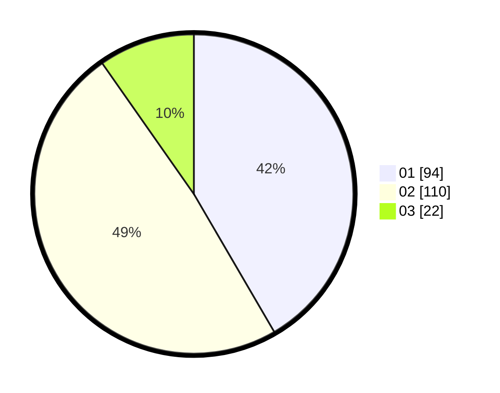

# Hasil

Hasil perolehan suara paslon dapat dilihat pada file paslon-01.txt, paslon-02.txt, dan paslon-03.txt.

Jika tidak ada, artinya data tersebut belum ada pada SIREKAP.

## Perolehan Suara

 * Paslon 01: **94**.
 * Paslon 02: **110**.
 * Paslon 03: **22**.

## Foto C Plano

https://sirekap-obj-formc.kpu.go.id/6ee0/pemilu/ppwp/31/72/04/10/07/3172041007058-20240214-211155--2cf88dd3-0032-4201-898b-0560bfb8c814.jpg

https://sirekap-obj-formc.kpu.go.id/6ee0/pemilu/ppwp/31/72/04/10/07/3172041007058-20240214-200733--f1b535b9-056b-4154-944f-d06ce45fd6d2.jpg

https://sirekap-obj-formc.kpu.go.id/6ee0/pemilu/ppwp/31/72/04/10/07/3172041007058-20240214-200851--ac2736e4-4c70-489d-9724-9ada72a908b0.jpg

## DATA PEMILIH TETAP

Jumlah pemilih dalam DPT: **287**.
 * L: **146**.
 * P: **141**.

## DATA PENGGUNA HAK PILIH

Jumlah pengguna hak pilih dalam DPT: **226**.
 * L: **111**.
 * P: **115**.

Jumlah pengguna hak pilih dalam DPTb: **0**.
 * L: **0**.
 * P: **0**.

Jumlah pengguna hak pilih dalam DPK: **4**.
 * L: **1**.
 * P: **3**.

Jumlah pengguna hak pilih: **230**.
 * L: **112**.
 * P: **118**.

## JUMLAH SUARA SAH DAN TIDAK SAH

JUMLAH SELURUH SUARA SAH: **226**.

JUMLAH SUARA TIDAK SAH: **4**.

JUMLAH SELURUH SUARA SAH DAN SUARA TIDAK SAH: **230**.
