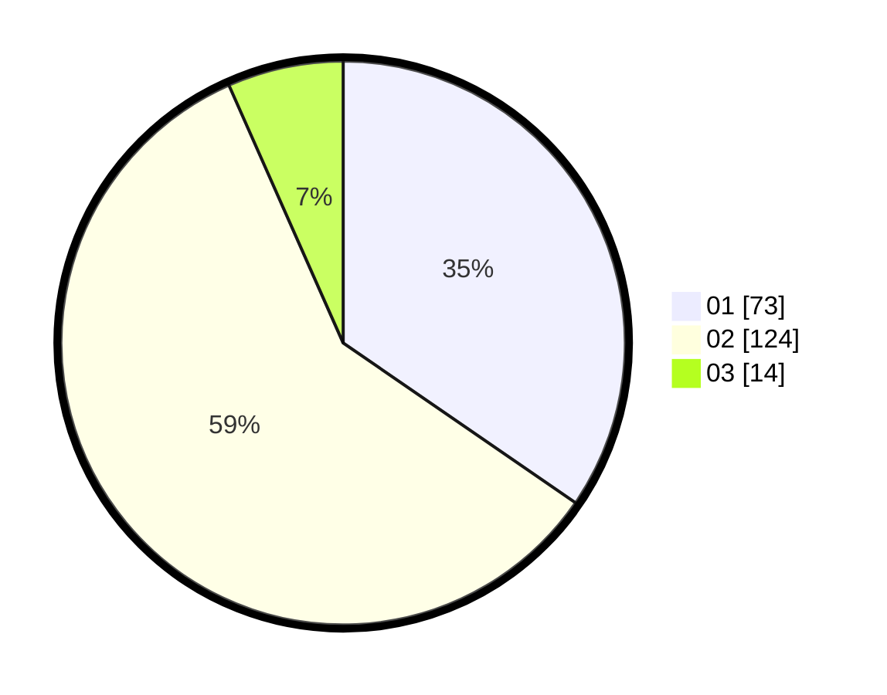

# Hasil

Hasil perolehan suara paslon dapat dilihat pada file paslon-01.txt, paslon-02.txt, dan paslon-03.txt.

Jika tidak ada, artinya data tersebut belum ada pada SIREKAP.

## Perolehan Suara

 * Paslon 01: **73**.
 * Paslon 02: **124**.
 * Paslon 03: **14**.

## Foto C Plano

https://sirekap-obj-formc.kpu.go.id/6530/pemilu/ppwp/31/72/04/10/07/3172041007071-20240214-155045--5e18fedf-b3f5-4e6b-ae5a-d0ed200bc2a5.jpg

https://sirekap-obj-formc.kpu.go.id/6530/pemilu/ppwp/31/72/04/10/07/3172041007071-20240214-155241--b7358960-0b25-4141-8a42-a4eded230047.jpg

https://sirekap-obj-formc.kpu.go.id/6530/pemilu/ppwp/31/72/04/10/07/3172041007071-20240214-155328--2efd8657-dcac-4c56-b444-ffdc0d51b6ca.jpg

## DATA PEMILIH TETAP

Jumlah pemilih dalam DPT: **290**.
 * L: **153**.
 * P: **137**.

## DATA PENGGUNA HAK PILIH

Jumlah pengguna hak pilih dalam DPT: **221**.
 * L: **120**.
 * P: **101**.

Jumlah pengguna hak pilih dalam DPTb: **0**.
 * L: **0**.
 * P: **0**.

Jumlah pengguna hak pilih dalam DPK: **0**.
 * L: **0**.
 * P: **0**.

Jumlah pengguna hak pilih: **221**.
 * L: **120**.
 * P: **101**.

## JUMLAH SUARA SAH DAN TIDAK SAH

JUMLAH SELURUH SUARA SAH: **211**.

JUMLAH SUARA TIDAK SAH: **10**.

JUMLAH SELURUH SUARA SAH DAN SUARA TIDAK SAH: **221**.
