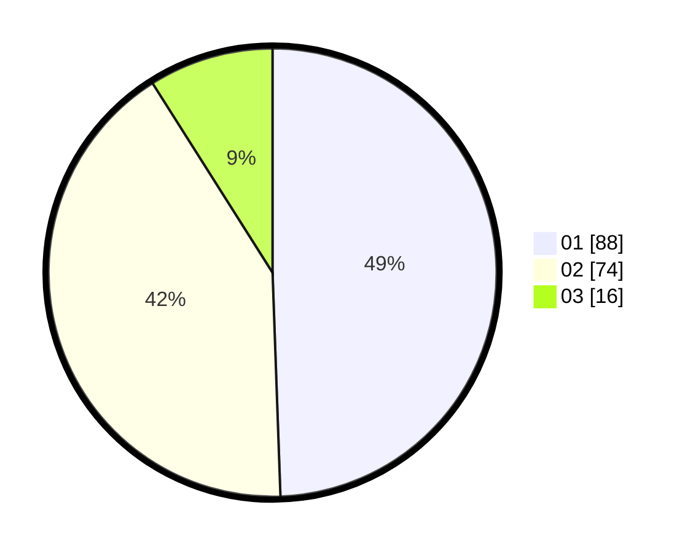

# Hasil

Hasil perolehan suara paslon dapat dilihat pada file paslon-01.txt, paslon-02.txt, dan paslon-03.txt.

Jika tidak ada, artinya data tersebut belum ada pada SIREKAP.

## Perolehan Suara

 * Paslon 01: **88**.
 * Paslon 02: **74**.
 * Paslon 03: **16**.

## Foto C Plano

https://sirekap-obj-formc.kpu.go.id/f4c9/pemilu/ppwp/31/72/04/10/07/3172041007078-20240216-132804--8889ddbe-4f5b-4dec-9506-2c6960e88954.jpg

https://sirekap-obj-formc.kpu.go.id/f4c9/pemilu/ppwp/31/72/04/10/07/3172041007078-20240216-132806--a2a8774b-1397-4c3f-be7f-69af4e2b796f.jpg

https://sirekap-obj-formc.kpu.go.id/f4c9/pemilu/ppwp/31/72/04/10/07/3172041007078-20240216-132805--6bc5ac37-0c57-4e63-9d1e-98d5ed278ac5.jpg

## DATA PEMILIH TETAP

Jumlah pemilih dalam DPT: **233**.
 * L: **115**.
 * P: **118**.

## DATA PENGGUNA HAK PILIH

Jumlah pengguna hak pilih dalam DPT: **177**.
 * L: **80**.
 * P: **97**.

Jumlah pengguna hak pilih dalam DPTb: **1**.
 * L: **0**.
 * P: **1**.

Jumlah pengguna hak pilih dalam DPK: **1**.
 * L: **1**.
 * P: **0**.

Jumlah pengguna hak pilih: **179**.
 * L: **81**.
 * P: **98**.

## JUMLAH SUARA SAH DAN TIDAK SAH

JUMLAH SELURUH SUARA SAH: **178**.

JUMLAH SUARA TIDAK SAH: **1**.

JUMLAH SELURUH SUARA SAH DAN SUARA TIDAK SAH: **179**.
