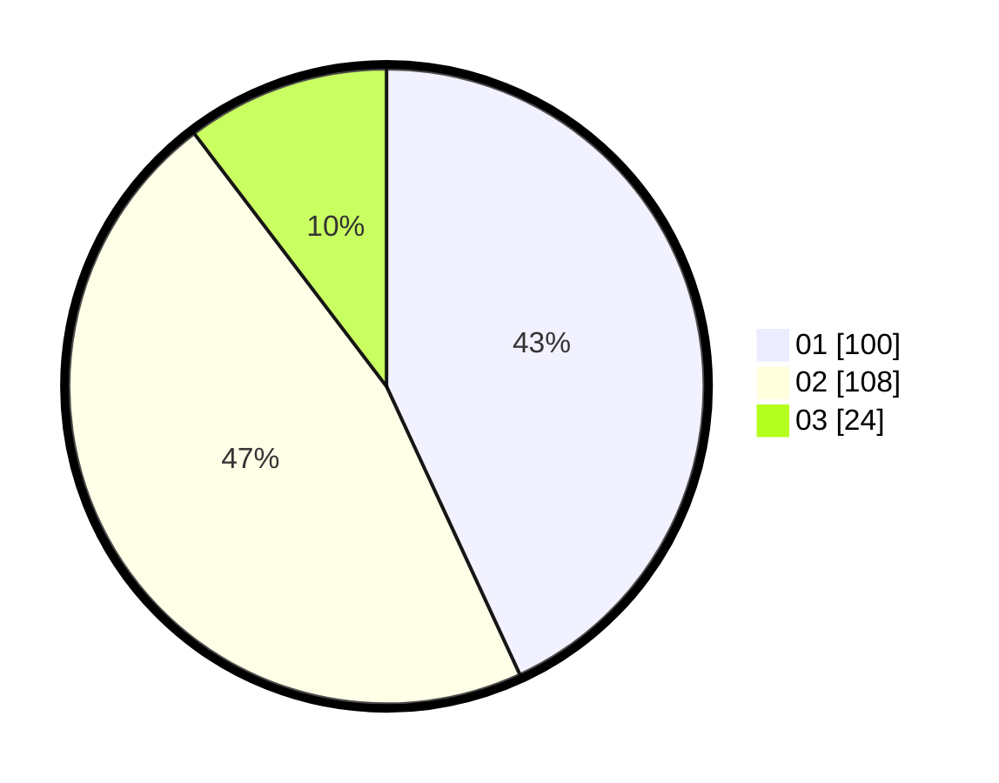

# Hasil

Hasil perolehan suara paslon dapat dilihat pada file paslon-01.txt, paslon-02.txt, dan paslon-03.txt.

Jika tidak ada, artinya data tersebut belum ada pada SIREKAP.

## Perolehan Suara

 * Paslon 01: **100**.
 * Paslon 02: **108**.
 * Paslon 03: **24**.

## Foto C Plano

https://sirekap-obj-formc.kpu.go.id/a8da/pemilu/ppwp/31/72/04/10/07/3172041007083-20240214-191738--9859fcca-bb0e-4cc2-8825-9a8c20bd7139.jpg

https://sirekap-obj-formc.kpu.go.id/a8da/pemilu/ppwp/31/72/04/10/07/3172041007083-20240214-191841--3f0938e3-d84d-46d4-b041-95082fbcc967.jpg

https://sirekap-obj-formc.kpu.go.id/a8da/pemilu/ppwp/31/72/04/10/07/3172041007083-20240214-191909--2a5614f9-87bc-47a0-a320-536e67aaa22d.jpg

## DATA PEMILIH TETAP

Jumlah pemilih dalam DPT: **291**.
 * L: **147**.
 * P: **144**.

## DATA PENGGUNA HAK PILIH

Jumlah pengguna hak pilih dalam DPT: **227**.
 * L: **107**.
 * P: **120**.

Jumlah pengguna hak pilih dalam DPTb: **5**.
 * L: **3**.
 * P: **2**.

Jumlah pengguna hak pilih dalam DPK: **0**.
 * L: **0**.
 * P: **0**.

Jumlah pengguna hak pilih: **232**.
 * L: **110**.
 * P: **122**.

## JUMLAH SUARA SAH DAN TIDAK SAH

JUMLAH SELURUH SUARA SAH: **232**.

JUMLAH SUARA TIDAK SAH: **0**.

JUMLAH SELURUH SUARA SAH DAN SUARA TIDAK SAH: **232**.
