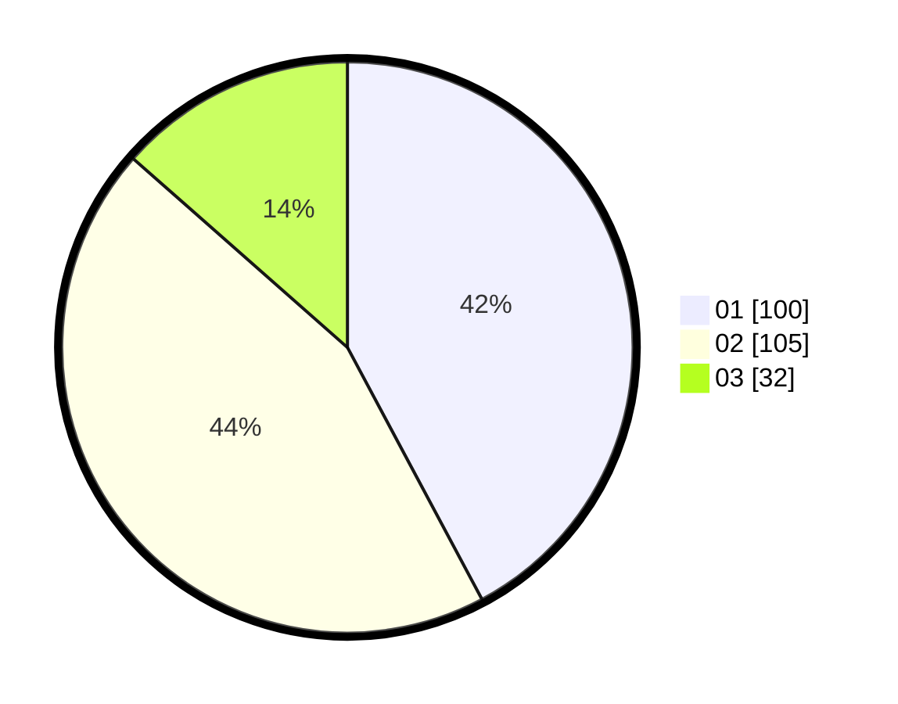

# Hasil

Hasil perolehan suara paslon dapat dilihat pada file paslon-01.txt, paslon-02.txt, dan paslon-03.txt.

Jika tidak ada, artinya data tersebut belum ada pada SIREKAP.

## Perolehan Suara

 * Paslon 01: **100**.
 * Paslon 02: **105**.
 * Paslon 03: **32**.

## Foto C Plano

https://sirekap-obj-formc.kpu.go.id/a144/pemilu/ppwp/31/72/04/10/07/3172041007084-20240214-201953--995feb8e-3082-45ab-84ac-dada20d3fc50.jpg

https://sirekap-obj-formc.kpu.go.id/a144/pemilu/ppwp/31/72/04/10/07/3172041007084-20240214-155322--c45a5a90-b666-4398-88c0-71b9c19905d9.jpg

https://sirekap-obj-formc.kpu.go.id/a144/pemilu/ppwp/31/72/04/10/07/3172041007084-20240214-155132--b28256ab-2894-4dd2-9cb1-62dc9ac7e81f.jpg
