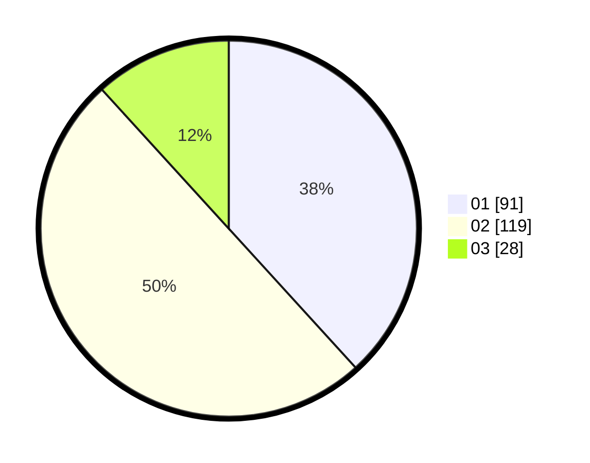

# Hasil

Hasil perolehan suara paslon dapat dilihat pada file paslon-01.txt, paslon-02.txt, dan paslon-03.txt.

Jika tidak ada, artinya data tersebut belum ada pada SIREKAP.

## Perolehan Suara

 * Paslon 01: **91**.
 * Paslon 02: **119**.
 * Paslon 03: **28**.

## Foto C Plano

https://sirekap-obj-formc.kpu.go.id/4cb0/pemilu/ppwp/31/72/04/10/07/3172041007108-20240215-223104--52f32098-f5ee-4de4-ad81-73eb1ecdd37c.jpg

https://sirekap-obj-formc.kpu.go.id/4cb0/pemilu/ppwp/31/72/04/10/07/3172041007108-20240214-205855--c86ade51-523c-4d3c-af3d-5e900902ac57.jpg

https://sirekap-obj-formc.kpu.go.id/4cb0/pemilu/ppwp/31/72/04/10/07/3172041007108-20240214-210010--3222ee90-090c-4363-89ea-59d5eff15d07.jpg

## DATA PEMILIH TETAP

Jumlah pemilih dalam DPT: **295**.
 * L: **136**.
 * P: **159**.

## DATA PENGGUNA HAK PILIH

Jumlah pengguna hak pilih dalam DPT: **236**.
 * L: **107**.
 * P: **129**.

Jumlah pengguna hak pilih dalam DPTb: **0**.
 * L: **0**.
 * P: **0**.

Jumlah pengguna hak pilih dalam DPK: **4**.
 * L: **1**.
 * P: **3**.

Jumlah pengguna hak pilih: **240**.
 * L: **108**.
 * P: **132**.

## JUMLAH SUARA SAH DAN TIDAK SAH

JUMLAH SELURUH SUARA SAH: **238**.

JUMLAH SUARA TIDAK SAH: **2**.

JUMLAH SELURUH SUARA SAH DAN SUARA TIDAK SAH: **240**.
