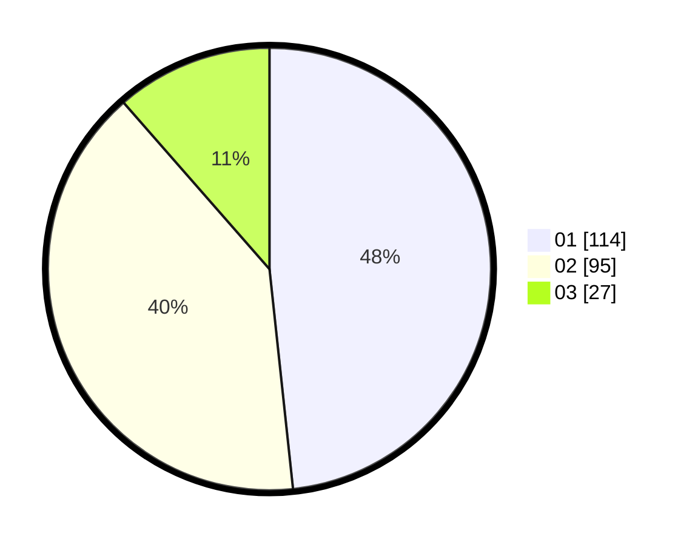

# Hasil

Hasil perolehan suara paslon dapat dilihat pada file paslon-01.txt, paslon-02.txt, dan paslon-03.txt.

Jika tidak ada, artinya data tersebut belum ada pada SIREKAP.

## Perolehan Suara

 * Paslon 01: **114**.
 * Paslon 02: **95**.
 * Paslon 03: **27**.

## Foto C Plano

https://sirekap-obj-formc.kpu.go.id/bd70/pemilu/ppwp/31/72/04/10/07/3172041007110-20240216-111635--69b57061-02c7-435e-9e32-f06d2a8fcfe3.jpg

https://sirekap-obj-formc.kpu.go.id/bd70/pemilu/ppwp/31/72/04/10/07/3172041007110-20240218-163916--7f94a428-5ef3-49e6-8d72-8d22c39d0766.jpg

https://sirekap-obj-formc.kpu.go.id/bd70/pemilu/ppwp/31/72/04/10/07/3172041007110-20240218-162426--29ea922c-0aba-4ca1-ac9d-bf4c6478ebc9.jpg

## DATA PEMILIH TETAP

Jumlah pemilih dalam DPT: **290**.
 * L: **142**.
 * P: **148**.

## DATA PENGGUNA HAK PILIH

Jumlah pengguna hak pilih dalam DPT: **232**.
 * L: **110**.
 * P: **122**.

Jumlah pengguna hak pilih dalam DPTb: **1**.
 * L: **1**.
 * P: **0**.

Jumlah pengguna hak pilih dalam DPK: **7**.
 * L: **2**.
 * P: **5**.

Jumlah pengguna hak pilih: **240**.
 * L: **113**.
 * P: **127**.

## JUMLAH SUARA SAH DAN TIDAK SAH

JUMLAH SELURUH SUARA SAH: **236**.

JUMLAH SUARA TIDAK SAH: **4**.

JUMLAH SELURUH SUARA SAH DAN SUARA TIDAK SAH: **240**.
