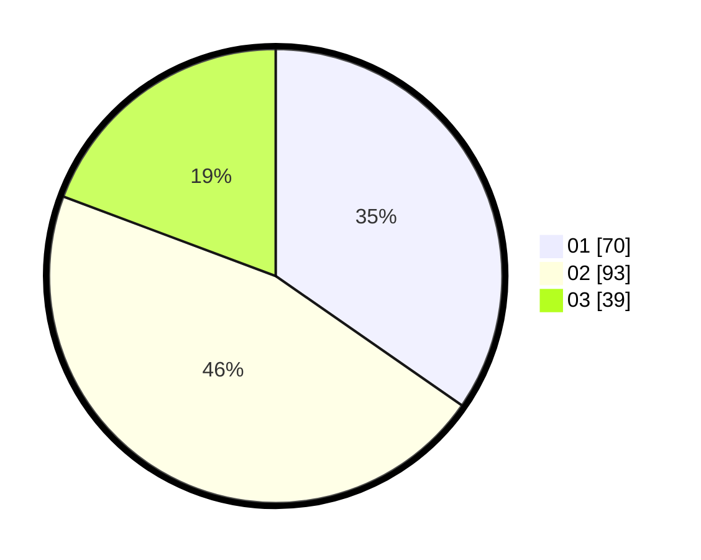

# Hasil

Hasil perolehan suara paslon dapat dilihat pada file paslon-01.txt, paslon-02.txt, dan paslon-03.txt.

Jika tidak ada, artinya data tersebut belum ada pada SIREKAP.

## Perolehan Suara

 * Paslon 01: **70**.
 * Paslon 02: **93**.
 * Paslon 03: **39**.

## Foto C Plano

https://sirekap-obj-formc.kpu.go.id/9142/pemilu/ppwp/31/72/04/10/07/3172041007122-20240214-200016--81c6401b-3f3b-4241-9f13-2d1aec790f49.jpg

https://sirekap-obj-formc.kpu.go.id/9142/pemilu/ppwp/31/72/04/10/07/3172041007122-20240214-200027--649c3b24-498f-4e40-8288-5da66497ccbe.jpg

https://sirekap-obj-formc.kpu.go.id/9142/pemilu/ppwp/31/72/04/10/07/3172041007122-20240214-200035--0d9d6101-a3a8-429d-9819-b236baf5bcd6.jpg

## DATA PEMILIH TETAP

Jumlah pemilih dalam DPT: **289**.
 * L: **145**.
 * P: **144**.

## DATA PENGGUNA HAK PILIH

Jumlah pengguna hak pilih dalam DPT: **205**.
 * L: **99**.
 * P: **106**.

Jumlah pengguna hak pilih dalam DPTb: **0**.
 * L: **0**.
 * P: **0**.

Jumlah pengguna hak pilih dalam DPK: **0**.
 * L: **0**.
 * P: **0**.

Jumlah pengguna hak pilih: **205**.
 * L: **99**.
 * P: **106**.

## JUMLAH SUARA SAH DAN TIDAK SAH

JUMLAH SELURUH SUARA SAH: **202**.

JUMLAH SUARA TIDAK SAH: **3**.

JUMLAH SELURUH SUARA SAH DAN SUARA TIDAK SAH: **205**.
