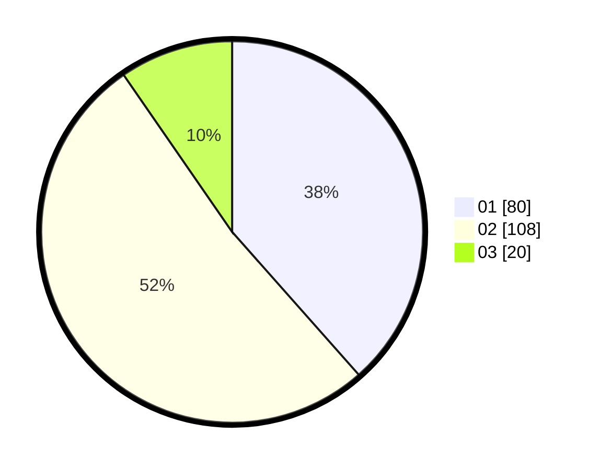

# Hasil

Hasil perolehan suara paslon dapat dilihat pada file paslon-01.txt, paslon-02.txt, dan paslon-03.txt.

Jika tidak ada, artinya data tersebut belum ada pada SIREKAP.

## Perolehan Suara

 * Paslon 01: **80**.
 * Paslon 02: **108**.
 * Paslon 03: **20**.

## Foto C Plano

https://sirekap-obj-formc.kpu.go.id/2420/pemilu/ppwp/31/72/04/10/07/3172041007138-20240214-223122--74aed1f3-e8f7-4e1b-b3f9-aef16e17aa31.jpg

https://sirekap-obj-formc.kpu.go.id/2420/pemilu/ppwp/31/72/04/10/07/3172041007138-20240214-223227--05168b2a-ad4d-458e-b9d7-b3044294dbda.jpg

https://sirekap-obj-formc.kpu.go.id/2420/pemilu/ppwp/31/72/04/10/07/3172041007138-20240214-223344--5bc09cbd-e71f-46b7-901f-7caac4212b34.jpg

## DATA PEMILIH TETAP

Jumlah pemilih dalam DPT: **294**.
 * L: **149**.
 * P: **145**.

## DATA PENGGUNA HAK PILIH

Jumlah pengguna hak pilih dalam DPT: **204**.
 * L: **93**.
 * P: **111**.

Jumlah pengguna hak pilih dalam DPTb: **2**.
 * L: **1**.
 * P: **1**.

Jumlah pengguna hak pilih dalam DPK: **4**.
 * L: **2**.
 * P: **2**.

Jumlah pengguna hak pilih: **210**.
 * L: **96**.
 * P: **114**.

## JUMLAH SUARA SAH DAN TIDAK SAH

JUMLAH SELURUH SUARA SAH: **208**.

JUMLAH SUARA TIDAK SAH: **2**.

JUMLAH SELURUH SUARA SAH DAN SUARA TIDAK SAH: **210**.
