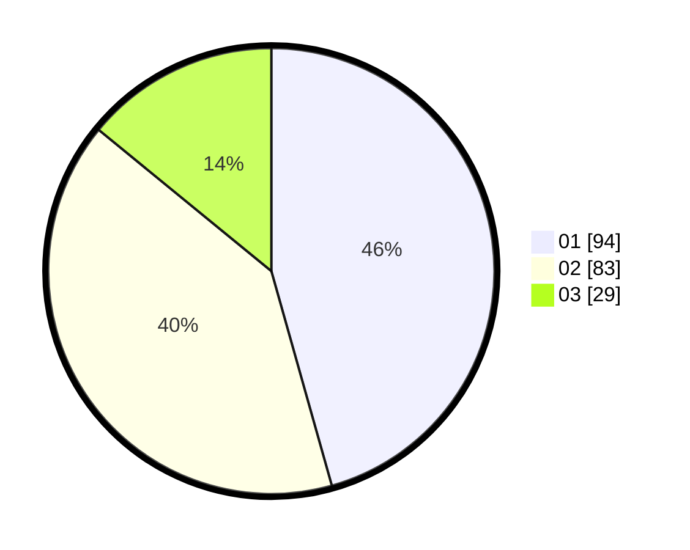

# Hasil

Hasil perolehan suara paslon dapat dilihat pada file paslon-01.txt, paslon-02.txt, dan paslon-03.txt.

Jika tidak ada, artinya data tersebut belum ada pada SIREKAP.

## Perolehan Suara

 * Paslon 01: **94**.
 * Paslon 02: **83**.
 * Paslon 03: **29**.

## Foto C Plano

https://sirekap-obj-formc.kpu.go.id/3c8c/pemilu/ppwp/31/72/04/10/07/3172041007148-20240215-004106--5e4569a3-108f-48c3-9df5-7aceeafffb5c.jpg

https://sirekap-obj-formc.kpu.go.id/3c8c/pemilu/ppwp/31/72/04/10/07/3172041007148-20240215-004156--8aabeee6-86e3-44ed-9d85-cad83d6f156a.jpg

https://sirekap-obj-formc.kpu.go.id/3c8c/pemilu/ppwp/31/72/04/10/07/3172041007148-20240215-003152--c9652376-d455-4029-b3f8-d51ac4a1b967.jpg

## DATA PEMILIH TETAP

Jumlah pemilih dalam DPT: **278**.
 * L: **140**.
 * P: **138**.

## DATA PENGGUNA HAK PILIH

Jumlah pengguna hak pilih dalam DPT: **208**.
 * L: **105**.
 * P: **103**.

Jumlah pengguna hak pilih dalam DPTb: **0**.
 * L: **0**.
 * P: **0**.

Jumlah pengguna hak pilih dalam DPK: **0**.
 * L: **0**.
 * P: **0**.

Jumlah pengguna hak pilih: **208**.
 * L: **105**.
 * P: **103**.

## JUMLAH SUARA SAH DAN TIDAK SAH

JUMLAH SELURUH SUARA SAH: **206**.

JUMLAH SUARA TIDAK SAH: **2**.

JUMLAH SELURUH SUARA SAH DAN SUARA TIDAK SAH: **208**.
