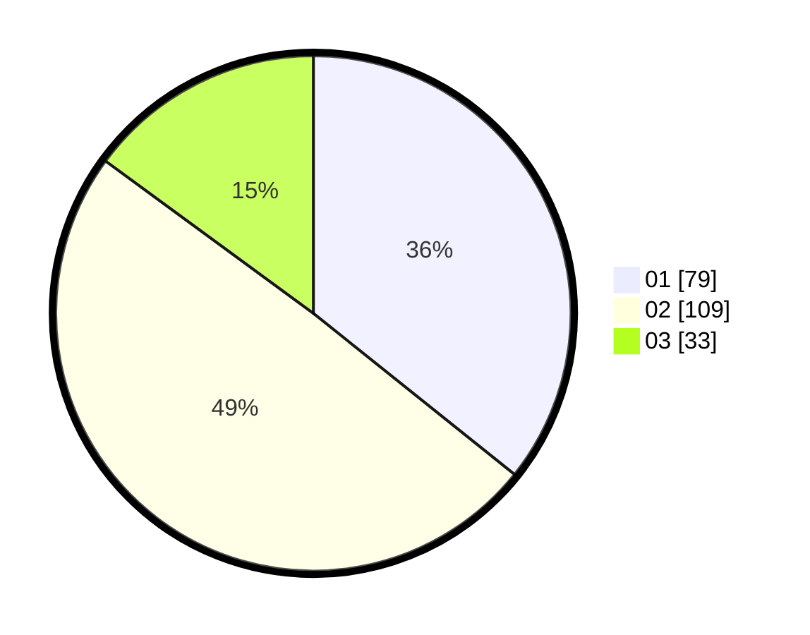

# Hasil

Hasil perolehan suara paslon dapat dilihat pada file paslon-01.txt, paslon-02.txt, dan paslon-03.txt.

Jika tidak ada, artinya data tersebut belum ada pada SIREKAP.

## Perolehan Suara

 * Paslon 01: **79**.
 * Paslon 02: **109**.
 * Paslon 03: **33**.

## Foto C Plano

https://sirekap-obj-formc.kpu.go.id/0a2f/pemilu/ppwp/31/72/04/10/07/3172041007169-20240215-005510--cb8dd89d-5960-4130-9ead-9cb9daf5369c.jpg

https://sirekap-obj-formc.kpu.go.id/0a2f/pemilu/ppwp/31/72/04/10/07/3172041007169-20240216-145313--8174dbbb-f5ea-4ca6-9c79-8ec351f9c914.jpg

https://sirekap-obj-formc.kpu.go.id/0a2f/pemilu/ppwp/31/72/04/10/07/3172041007169-20240215-010346--91e94c71-c199-475e-8ab4-83d8fbd3130a.jpg

## DATA PEMILIH TETAP

Jumlah pemilih dalam DPT: **290**.
 * L: **138**.
 * P: **152**.

## DATA PENGGUNA HAK PILIH

Jumlah pengguna hak pilih dalam DPT: **219**.
 * L: **104**.
 * P: **115**.

Jumlah pengguna hak pilih dalam DPTb: **0**.
 * L: **0**.
 * P: **0**.

Jumlah pengguna hak pilih dalam DPK: **4**.
 * L: **1**.
 * P: **3**.

Jumlah pengguna hak pilih: **223**.
 * L: **105**.
 * P: **118**.

## JUMLAH SUARA SAH DAN TIDAK SAH

JUMLAH SELURUH SUARA SAH: **221**.

JUMLAH SUARA TIDAK SAH: **2**.

JUMLAH SELURUH SUARA SAH DAN SUARA TIDAK SAH: **223**.
