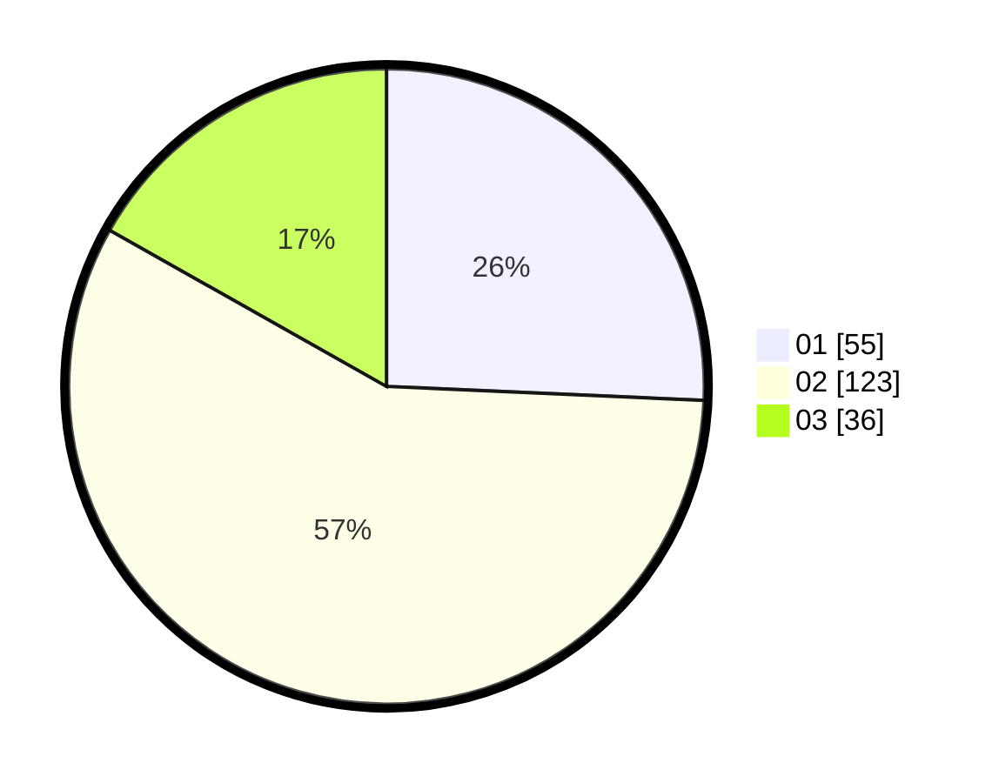

# Hasil

Hasil perolehan suara paslon dapat dilihat pada file paslon-01.txt, paslon-02.txt, dan paslon-03.txt.

Jika tidak ada, artinya data tersebut belum ada pada SIREKAP.

## Perolehan Suara

 * Paslon 01: **55**.
 * Paslon 02: **123**.
 * Paslon 03: **36**.

## Foto C Plano

https://sirekap-obj-formc.kpu.go.id/ed01/pemilu/ppwp/31/72/04/10/07/3172041007181-20240214-193834--6086adc3-fd63-4f88-9699-23fc9c9ac991.jpg

https://sirekap-obj-formc.kpu.go.id/ed01/pemilu/ppwp/31/72/04/10/07/3172041007181-20240214-193939--e90197e5-2d78-42ae-8c3a-e633e1cd0449.jpg

https://sirekap-obj-formc.kpu.go.id/ed01/pemilu/ppwp/31/72/04/10/07/3172041007181-20240214-194017--4e19b5da-3b89-4979-8852-ac28c500f21e.jpg

## DATA PEMILIH TETAP

Jumlah pemilih dalam DPT: **275**.
 * L: **136**.
 * P: **139**.

## DATA PENGGUNA HAK PILIH

Jumlah pengguna hak pilih dalam DPT: **220**.
 * L: **107**.
 * P: **113**.

Jumlah pengguna hak pilih dalam DPTb: **0**.
 * L: **0**.
 * P: **0**.

Jumlah pengguna hak pilih dalam DPK: **2**.
 * L: **0**.
 * P: **2**.

Jumlah pengguna hak pilih: **222**.
 * L: **107**.
 * P: **115**.

## JUMLAH SUARA SAH DAN TIDAK SAH

JUMLAH SELURUH SUARA SAH: **214**.

JUMLAH SUARA TIDAK SAH: **9**.

JUMLAH SELURUH SUARA SAH DAN SUARA TIDAK SAH: **223**.
