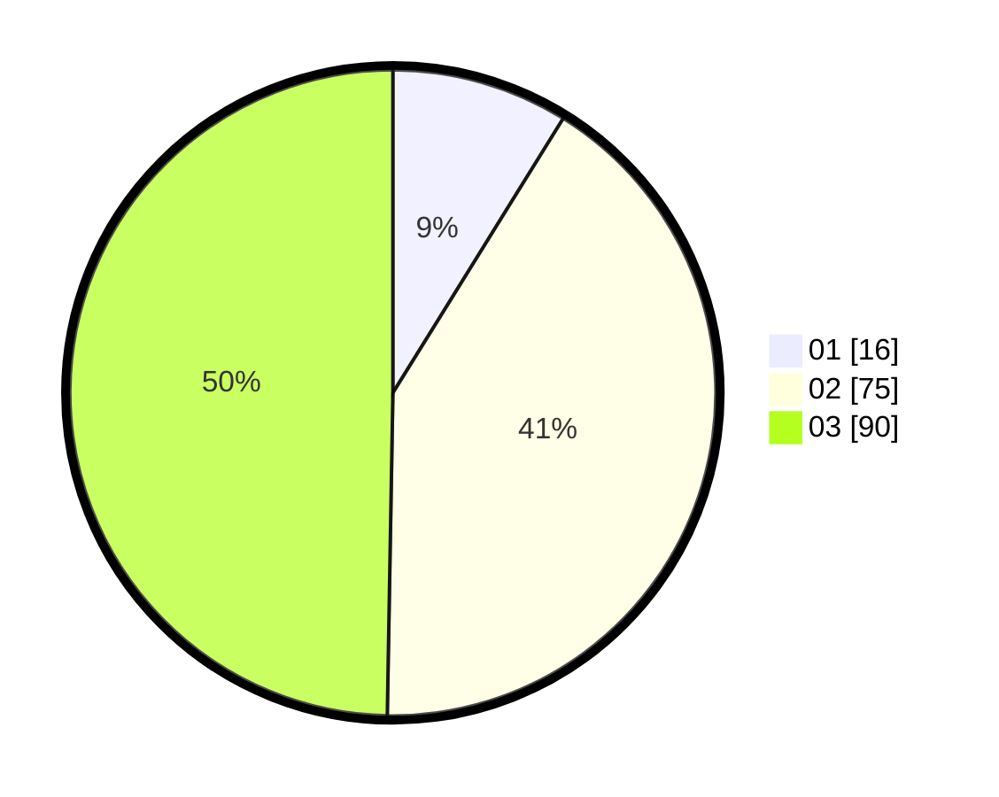

# Hasil

Hasil perolehan suara paslon dapat dilihat pada file paslon-01.txt, paslon-02.txt, dan paslon-03.txt.

Jika tidak ada, artinya data tersebut belum ada pada SIREKAP.

## Perolehan Suara

 * Paslon 01: **16**.
 * Paslon 02: **75**.
 * Paslon 03: **90**.

## Foto C Plano

https://sirekap-obj-formc.kpu.go.id/b023/pemilu/ppwp/31/72/05/10/01/3172051001003-20240217-110059--be695478-38df-4e7d-95e0-6f581d50edad.jpg

https://sirekap-obj-formc.kpu.go.id/b023/pemilu/ppwp/31/72/05/10/01/3172051001003-20240217-110127--43935c05-f536-4ed2-8e64-f605e0da3963.jpg

https://sirekap-obj-formc.kpu.go.id/b023/pemilu/ppwp/31/72/05/10/01/3172051001003-20240217-110309--2243d63f-733c-48ad-8c5a-c024b7d89fa6.jpg

## DATA PEMILIH TETAP

Jumlah pemilih dalam DPT: **287**.
 * L: **135**.
 * P: **152**.

## DATA PENGGUNA HAK PILIH

Jumlah pengguna hak pilih dalam DPT: **181**.
 * L: **81**.
 * P: **100**.

Jumlah pengguna hak pilih dalam DPTb: **1**.
 * L: **1**.
 * P: **0**.

Jumlah pengguna hak pilih dalam DPK: **1**.
 * L: **0**.
 * P: **1**.

Jumlah pengguna hak pilih: **183**.
 * L: **82**.
 * P: **101**.

## JUMLAH SUARA SAH DAN TIDAK SAH

JUMLAH SELURUH SUARA SAH: **181**.

JUMLAH SUARA TIDAK SAH: **2**.

JUMLAH SELURUH SUARA SAH DAN SUARA TIDAK SAH: **183**.
