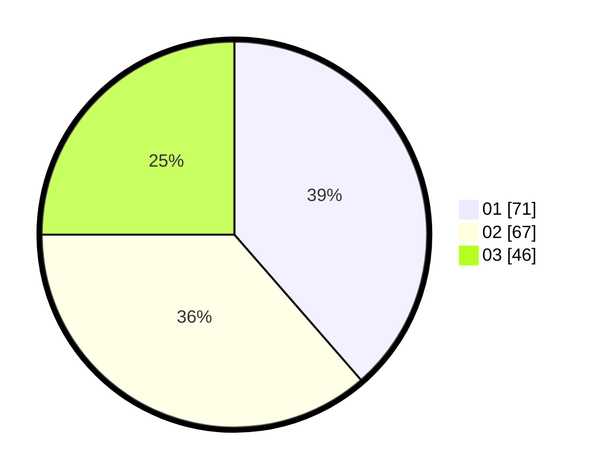

# Hasil

Hasil perolehan suara paslon dapat dilihat pada file paslon-01.txt, paslon-02.txt, dan paslon-03.txt.

Jika tidak ada, artinya data tersebut belum ada pada SIREKAP.

## Perolehan Suara

 * Paslon 01: **71**.
 * Paslon 02: **67**.
 * Paslon 03: **46**.

## Foto C Plano

https://sirekap-obj-formc.kpu.go.id/a904/pemilu/ppwp/31/72/05/10/01/3172051001005-20240217-155028--9f63dddc-50bb-4cf2-b483-5e3dac76b2ea.jpg

https://sirekap-obj-formc.kpu.go.id/a904/pemilu/ppwp/31/72/05/10/01/3172051001005-20240217-155332--44f7d39a-8d08-4abc-982a-7ca8c57aa049.jpg

https://sirekap-obj-formc.kpu.go.id/a904/pemilu/ppwp/31/72/05/10/01/3172051001005-20240217-155443--eff2ca13-96ca-48dd-bf7e-79762f0d5e66.jpg

## DATA PEMILIH TETAP

Jumlah pemilih dalam DPT: **286**.
 * L: **150**.
 * P: **136**.

## DATA PENGGUNA HAK PILIH

Jumlah pengguna hak pilih dalam DPT: **186**.
 * L: **98**.
 * P: **88**.

Jumlah pengguna hak pilih dalam DPTb: **0**.
 * L: **0**.
 * P: **0**.

Jumlah pengguna hak pilih dalam DPK: **1**.
 * L: **0**.
 * P: **1**.

Jumlah pengguna hak pilih: **187**.
 * L: **98**.
 * P: **89**.

## JUMLAH SUARA SAH DAN TIDAK SAH

JUMLAH SELURUH SUARA SAH: **184**.

JUMLAH SUARA TIDAK SAH: **3**.

JUMLAH SELURUH SUARA SAH DAN SUARA TIDAK SAH: **187**.
