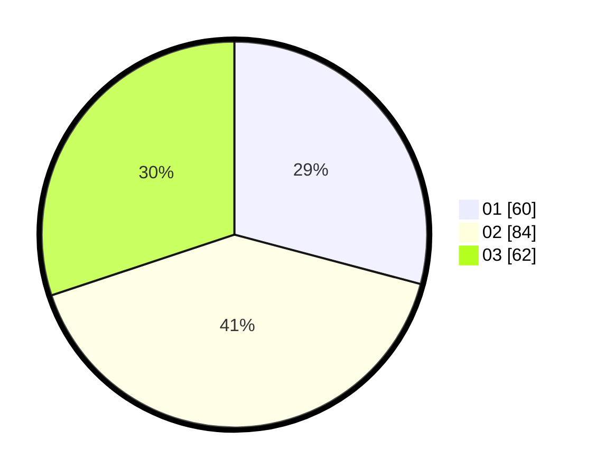

# Hasil

Hasil perolehan suara paslon dapat dilihat pada file paslon-01.txt, paslon-02.txt, dan paslon-03.txt.

Jika tidak ada, artinya data tersebut belum ada pada SIREKAP.

## Perolehan Suara

 * Paslon 01: **60**.
 * Paslon 02: **84**.
 * Paslon 03: **62**.

## Foto C Plano

https://sirekap-obj-formc.kpu.go.id/95d0/pemilu/ppwp/31/72/05/10/01/3172051001006-20240217-162127--40d6049d-0f55-4e76-9dbf-e627968d7e11.jpg

https://sirekap-obj-formc.kpu.go.id/95d0/pemilu/ppwp/31/72/05/10/01/3172051001006-20240217-163023--13a0c979-6e50-48b9-bcba-9c0825b57937.jpg

https://sirekap-obj-formc.kpu.go.id/95d0/pemilu/ppwp/31/72/05/10/01/3172051001006-20240217-162612--ba2f1341-86ed-460c-af2e-f9f9bcbb556b.jpg

## DATA PEMILIH TETAP

Jumlah pemilih dalam DPT: **283**.
 * L: **141**.
 * P: **142**.

## DATA PENGGUNA HAK PILIH

Jumlah pengguna hak pilih dalam DPT: **199**.
 * L: **104**.
 * P: **95**.

Jumlah pengguna hak pilih dalam DPTb: **4**.
 * L: **3**.
 * P: **1**.

Jumlah pengguna hak pilih dalam DPK: **4**.
 * L: **2**.
 * P: **2**.

Jumlah pengguna hak pilih: **207**.
 * L: **109**.
 * P: **98**.

## JUMLAH SUARA SAH DAN TIDAK SAH

JUMLAH SELURUH SUARA SAH: **206**.

JUMLAH SUARA TIDAK SAH: **1**.

JUMLAH SELURUH SUARA SAH DAN SUARA TIDAK SAH: **207**.
