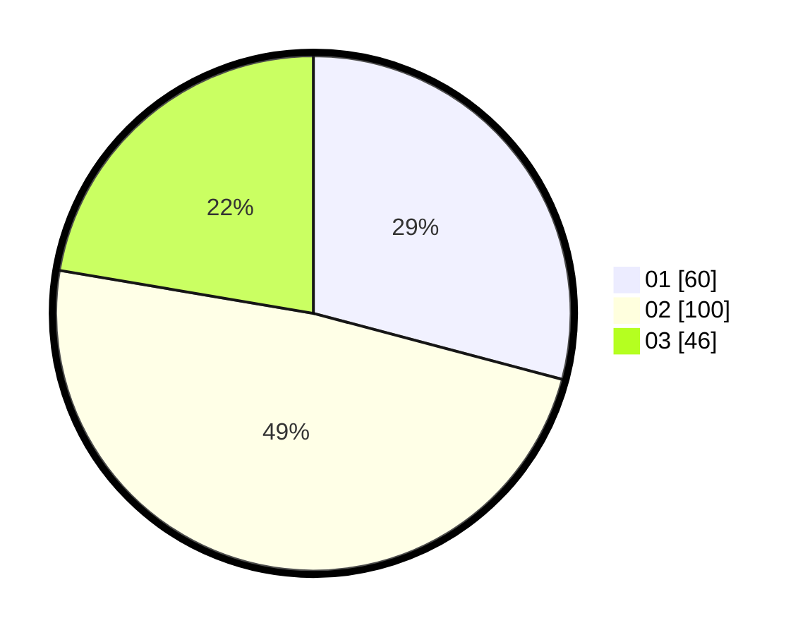

# Hasil

Hasil perolehan suara paslon dapat dilihat pada file paslon-01.txt, paslon-02.txt, dan paslon-03.txt.

Jika tidak ada, artinya data tersebut belum ada pada SIREKAP.

## Perolehan Suara

 * Paslon 01: **60**.
 * Paslon 02: **100**.
 * Paslon 03: **46**.

## Foto C Plano

https://sirekap-obj-formc.kpu.go.id/1013/pemilu/ppwp/31/72/05/10/01/3172051001007-20240217-113524--1132c0b6-7e02-4741-9292-8ec61ab08100.jpg

https://sirekap-obj-formc.kpu.go.id/1013/pemilu/ppwp/31/72/05/10/01/3172051001007-20240217-113548--9825c97f-2bab-4de6-b43f-1e6d89a8662e.jpg

https://sirekap-obj-formc.kpu.go.id/1013/pemilu/ppwp/31/72/05/10/01/3172051001007-20240217-113623--1ab70fa9-05f7-44e4-9377-0b7ffb110593.jpg

## DATA PEMILIH TETAP

Jumlah pemilih dalam DPT: **285**.
 * L: **152**.
 * P: **133**.

## DATA PENGGUNA HAK PILIH

Jumlah pengguna hak pilih dalam DPT: **205**.
 * L: **106**.
 * P: **99**.

Jumlah pengguna hak pilih dalam DPTb: **0**.
 * L: **0**.
 * P: **0**.

Jumlah pengguna hak pilih dalam DPK: **1**.
 * L: **1**.
 * P: **0**.

Jumlah pengguna hak pilih: **206**.
 * L: **107**.
 * P: **99**.

## JUMLAH SUARA SAH DAN TIDAK SAH

JUMLAH SELURUH SUARA SAH: **206**.

JUMLAH SUARA TIDAK SAH: **1**.

JUMLAH SELURUH SUARA SAH DAN SUARA TIDAK SAH: **207**.
