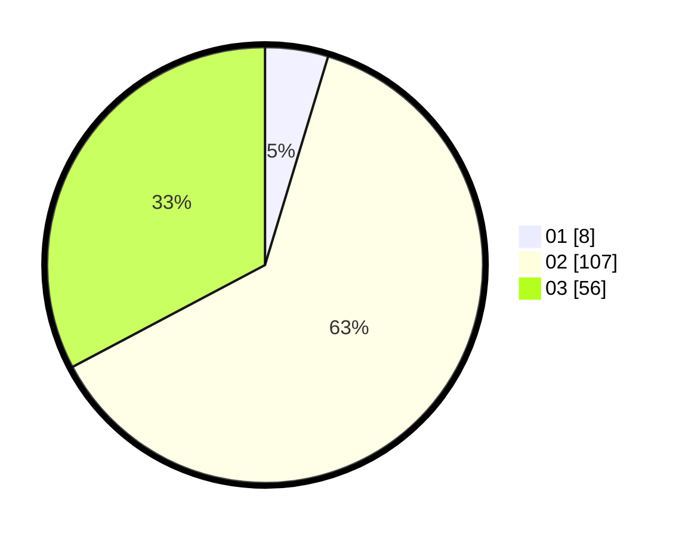

# Hasil

Hasil perolehan suara paslon dapat dilihat pada file paslon-01.txt, paslon-02.txt, dan paslon-03.txt.

Jika tidak ada, artinya data tersebut belum ada pada SIREKAP.

## Perolehan Suara

 * Paslon 01: **8**.
 * Paslon 02: **107**.
 * Paslon 03: **56**.

## Foto C Plano

https://sirekap-obj-formc.kpu.go.id/2993/pemilu/ppwp/31/72/05/10/01/3172051001025-20240216-010942--09e740c7-4228-4b32-900f-d520ebbbc39a.jpg

https://sirekap-obj-formc.kpu.go.id/2993/pemilu/ppwp/31/72/05/10/01/3172051001025-20240214-155608--278ed295-4f51-4141-b985-9fc96a17c60e.jpg

https://sirekap-obj-formc.kpu.go.id/2993/pemilu/ppwp/31/72/05/10/01/3172051001025-20240214-155133--fd60f0f9-71bf-41e1-a1fc-27f02a67190a.jpg

## DATA PEMILIH TETAP

Jumlah pemilih dalam DPT: **275**.
 * L: **134**.
 * P: **141**.

## DATA PENGGUNA HAK PILIH

Jumlah pengguna hak pilih dalam DPT: **170**.
 * L: **87**.
 * P: **83**.

Jumlah pengguna hak pilih dalam DPTb: **5**.
 * L: **0**.
 * P: **5**.

Jumlah pengguna hak pilih dalam DPK: **0**.
 * L: **0**.
 * P: **0**.

Jumlah pengguna hak pilih: **175**.
 * L: **87**.
 * P: **88**.

## JUMLAH SUARA SAH DAN TIDAK SAH

JUMLAH SELURUH SUARA SAH: **171**.

JUMLAH SUARA TIDAK SAH: **4**.

JUMLAH SELURUH SUARA SAH DAN SUARA TIDAK SAH: **175**.
