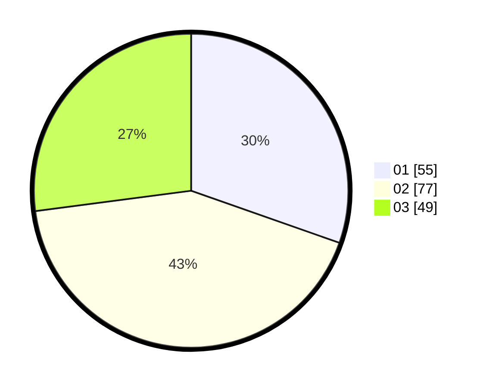

# Hasil

Hasil perolehan suara paslon dapat dilihat pada file paslon-01.txt, paslon-02.txt, dan paslon-03.txt.

Jika tidak ada, artinya data tersebut belum ada pada SIREKAP.

## Perolehan Suara

 * Paslon 01: **55**.
 * Paslon 02: **77**.
 * Paslon 03: **49**.

## Foto C Plano

https://sirekap-obj-formc.kpu.go.id/e35d/pemilu/ppwp/31/72/05/10/01/3172051001028-20240216-180119--25be2de5-7048-43da-a286-14201e0ff1ec.jpg

https://sirekap-obj-formc.kpu.go.id/e35d/pemilu/ppwp/31/72/05/10/01/3172051001028-20240216-180519--b4bd93d8-c071-478b-a38b-b5e26b06fb77.jpg

https://sirekap-obj-formc.kpu.go.id/e35d/pemilu/ppwp/31/72/05/10/01/3172051001028-20240216-180917--95b0fd00-4ebf-4992-8004-6913974c2959.jpg

## DATA PEMILIH TETAP

Jumlah pemilih dalam DPT: **288**.
 * L: **132**.
 * P: **156**.

## DATA PENGGUNA HAK PILIH

Jumlah pengguna hak pilih dalam DPT: **183**.
 * L: **84**.
 * P: **99**.

Jumlah pengguna hak pilih dalam DPTb: **0**.
 * L: **0**.
 * P: **0**.

Jumlah pengguna hak pilih dalam DPK: **0**.
 * L: **0**.
 * P: **0**.

Jumlah pengguna hak pilih: **183**.
 * L: **84**.
 * P: **99**.

## JUMLAH SUARA SAH DAN TIDAK SAH

JUMLAH SELURUH SUARA SAH: **181**.

JUMLAH SUARA TIDAK SAH: **2**.

JUMLAH SELURUH SUARA SAH DAN SUARA TIDAK SAH: **183**.
