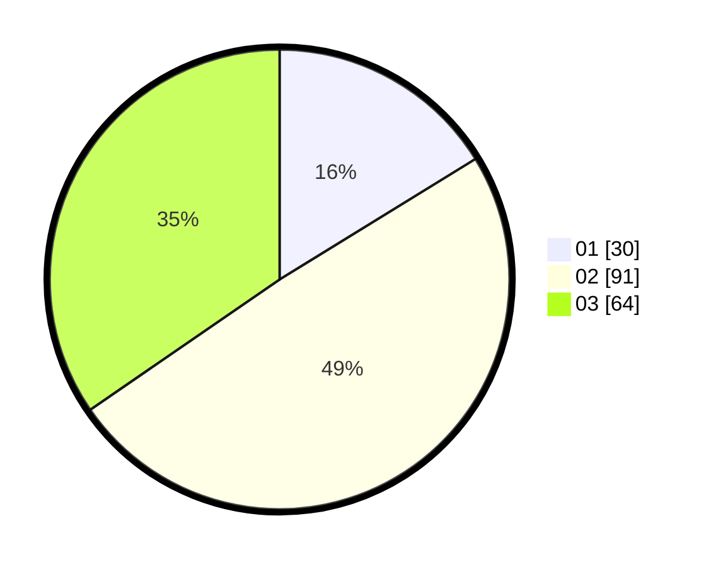

# Hasil

Hasil perolehan suara paslon dapat dilihat pada file paslon-01.txt, paslon-02.txt, dan paslon-03.txt.

Jika tidak ada, artinya data tersebut belum ada pada SIREKAP.

## Perolehan Suara

 * Paslon 01: **30**.
 * Paslon 02: **91**.
 * Paslon 03: **64**.

## Foto C Plano

https://sirekap-obj-formc.kpu.go.id/43bc/pemilu/ppwp/31/72/05/10/01/3172051001030-20240214-185318--16e5450f-480e-48ba-84bf-2ebd1368c307.jpg

https://sirekap-obj-formc.kpu.go.id/43bc/pemilu/ppwp/31/72/05/10/01/3172051001030-20240214-185336--12da1335-7227-4f68-99a1-9993c15bb0ee.jpg

https://sirekap-obj-formc.kpu.go.id/43bc/pemilu/ppwp/31/72/05/10/01/3172051001030-20240214-185400--ecdee56b-0d6a-45d2-9bb9-2d745d9c34f3.jpg

## DATA PEMILIH TETAP

Jumlah pemilih dalam DPT: **269**.
 * L: **134**.
 * P: **135**.

## DATA PENGGUNA HAK PILIH

Jumlah pengguna hak pilih dalam DPT: **190**.
 * L: **92**.
 * P: **98**.

Jumlah pengguna hak pilih dalam DPTb: **2**.
 * L: **1**.
 * P: **1**.

Jumlah pengguna hak pilih dalam DPK: **0**.
 * L: **0**.
 * P: **0**.

Jumlah pengguna hak pilih: **192**.
 * L: **93**.
 * P: **99**.

## JUMLAH SUARA SAH DAN TIDAK SAH

JUMLAH SELURUH SUARA SAH: **185**.

JUMLAH SUARA TIDAK SAH: **7**.

JUMLAH SELURUH SUARA SAH DAN SUARA TIDAK SAH: **192**.
