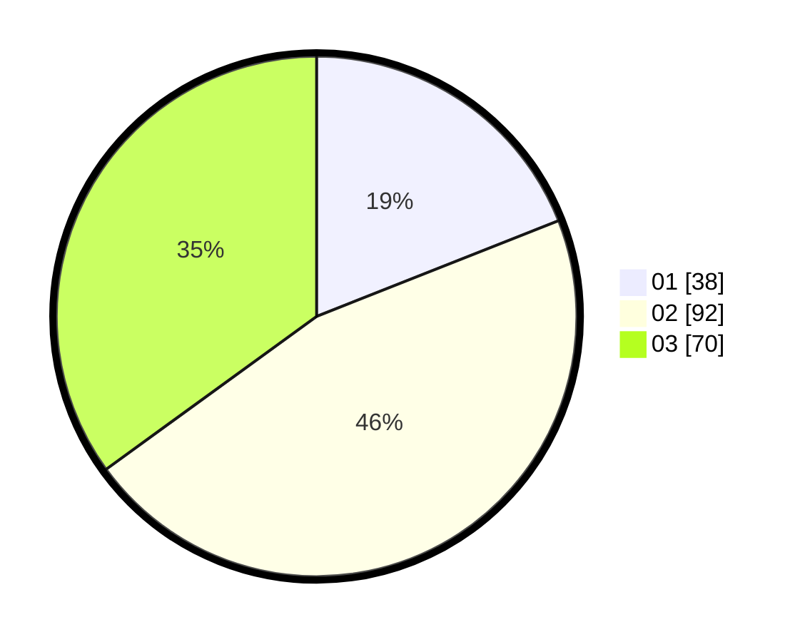

# Hasil

Hasil perolehan suara paslon dapat dilihat pada file paslon-01.txt, paslon-02.txt, dan paslon-03.txt.

Jika tidak ada, artinya data tersebut belum ada pada SIREKAP.

## Perolehan Suara

 * Paslon 01: **38**.
 * Paslon 02: **92**.
 * Paslon 03: **70**.

## Foto C Plano

https://sirekap-obj-formc.kpu.go.id/1e83/pemilu/ppwp/31/72/05/10/01/3172051001031-20240216-000057--9b4a6f4a-5a5c-4421-b3c3-c9661c7f4fdf.jpg

https://sirekap-obj-formc.kpu.go.id/1e83/pemilu/ppwp/31/72/05/10/01/3172051001031-20240216-000154--5f7109cb-fc39-4218-9b44-70d285621491.jpg

https://sirekap-obj-formc.kpu.go.id/1e83/pemilu/ppwp/31/72/05/10/01/3172051001031-20240216-000239--b8591ba8-bec3-4817-8af4-99d5a8f35487.jpg
