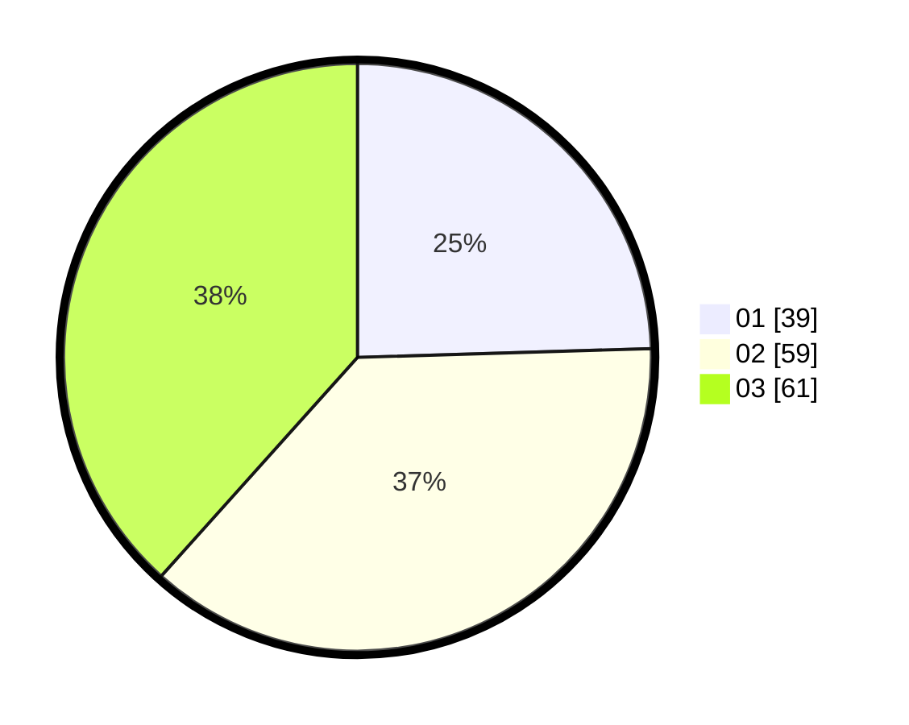

# Hasil

Hasil perolehan suara paslon dapat dilihat pada file paslon-01.txt, paslon-02.txt, dan paslon-03.txt.

Jika tidak ada, artinya data tersebut belum ada pada SIREKAP.

## Perolehan Suara

 * Paslon 01: **39**.
 * Paslon 02: **59**.
 * Paslon 03: **61**.

## Foto C Plano

https://sirekap-obj-formc.kpu.go.id/c186/pemilu/ppwp/31/72/05/10/01/3172051001033-20240214-233848--e03bc7b1-ca51-42a8-9020-fb2a5de31d4c.jpg

https://sirekap-obj-formc.kpu.go.id/c186/pemilu/ppwp/31/72/05/10/01/3172051001033-20240214-233945--01fc6902-5102-45e0-8eec-143b55d94643.jpg

https://sirekap-obj-formc.kpu.go.id/c186/pemilu/ppwp/31/72/05/10/01/3172051001033-20240214-234105--bb266cc7-ba19-4555-a5f0-4f3e1e70ac13.jpg
